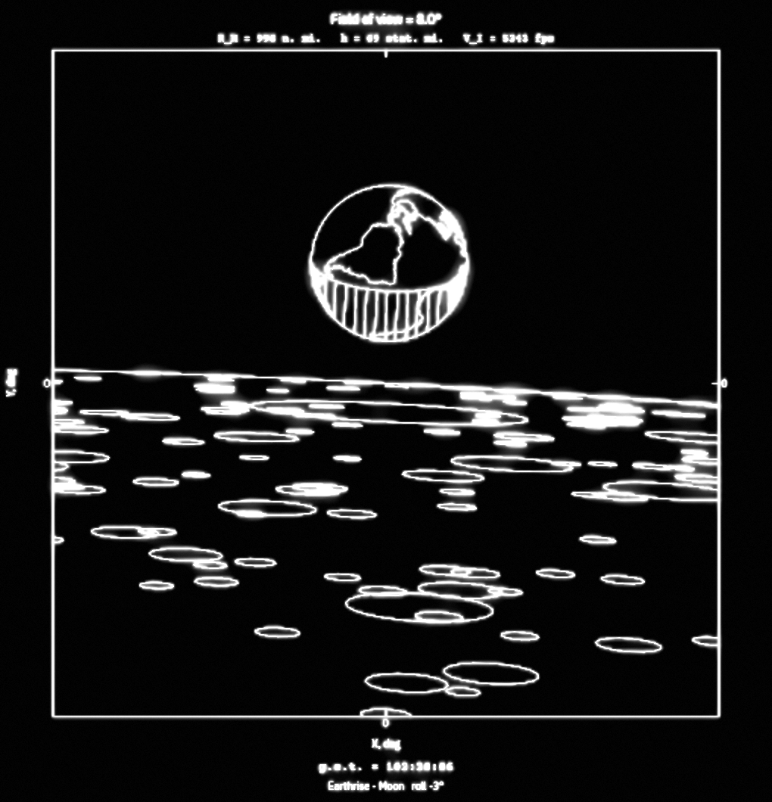
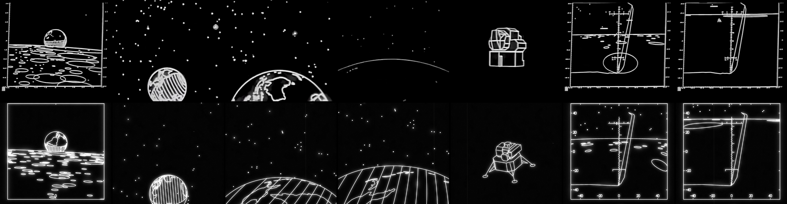

# VIEW-1108

[](LICENSE) [](https://github.com/aaronsb/view1108/actions/workflows/pages.yml) [](https://aaronsb.github.io/view1108/)

[](https://aaronsb.github.io/view1108/)

**[Run it in your browser →](https://aaronsb.github.io/view1108/)** Chrome 80, Firefox 113, Safari 16.4 or later: the page unpacks its mission data with the browser's gzip `DecompressionStream`.

In 1969 a FORTRAN program on a UNIVAC 1108 at NASA's Manned Spacecraft Center drew what the Apollo crews would see out their windows and through their optics: star fields for navigation, the Earth and Moon, the lunar surface through the LM's landing window. The frames went onto microfilm, and views were "incorporated into the Apollo flight-plan documents" (NASA TN D-6853, p. 10). We know of no surviving source code for it.

VIEW-1108 is a what-if: how it might have felt to operate VIEW if that 1108 could run the simulation in real time.

In 1969 a view was a batch job. The program integrated the trajectory, drew "at any nth value of the integration step", and a camera photographed the cathode-ray tube onto microfilm. Users could request "crude printer-plot images" for "a quick-look evaluation before the microfilm frames are received", and for most uses the frames were "printed on standard sheets of paper" (TN D-6853, p. 3). You asked a question and got the answer back later, on paper.

Here the answer comes back while you move. Drag, and the window turns; type a g.e.t., and the sky, the Earth and the Moon move to that moment of the Apollo 11 mission. The picture above is a frame from our kernel, not from the film. On the page every frame is computed live by FORTRAN 66/77-style code compiled to WebAssembly (or its JavaScript translation where WebAssembly is unavailable), and drawn as white lines on black, like the film.

Where it's going: from one film's scenes to whole Apollo missions (Apollo 8 and Apollo 11 first), phase by phase, with windows, cabins and spacecraft, and every modern addition labelled as one. See [docs/vision.md](docs/vision.md).

## What VIEW was

Every statement here comes from the two NASA reports in `reference/`.

- "The view program operates on the UNIVAC 1108 computer. The program is written in the FORTRAN V language ..." Its output "consists of microfilm frames produced by a camera that photographs an image constructed on the surface of a cathode-ray tube." (NASA TN D-6853, Hyle & Lunde, 1972, p. 3)
- It began as an aid "in the early Gemini rendezvous and docking studies" and was revived for Apollo. (TN D-6853, p. 2)
- On Apollo 13, with the guidance system powered down, "the views of the Earth were used as the sole attitude-reference source for a midcourse correction." (TN D-6853, p. 10)
- "The major analytical tool used to produce this report was developed by Mr. G. B. Roush of the Computation and Analysis Division." (MSC Internal Note 69-FM-197, *Revision 1 to Views from the CM and LM During the Flight of Apollo 11 (Mission G)*, A. N. Lunde, 3 July 1969; a 321-page scan, 303 numbered pages, mostly VIEW plots)

## The film and the reconstruction

A short clip believed to be VIEW film output (shared by NB, [@Noahbolanowski](https://x.com/Noahbolanowski/status/2104604683553669239); its archive source is unknown) has four shots: an Earthrise, the Earth approaching, the LM turning, and the LM's descent window. On load, the page replays those four shots live from the kernel, then settles into a slower tour of the same scenes.



## Operating it

The page is the console. It starts by replaying the film, then hands you the controls. A tab bar picks the workspace: **Review** (the film, the tour, the scenes), **Simulate** (the mission clock and our trajectory engine), **Print** (the beam trace and film effects), **Fusion** (crew photographs over the plot at their moment) and **Source** (the kernel's FORTRAN). [docs/modes.md](docs/modes.md) lists every tab, mode, scene, toggle and link parameter, with example links to share.

| Mode | Tab | What it does |
|---|---|---|
| **Attract** | Review | The film's four shots, at the film's pace (36 s). Plays once on load. |
| **Tour** | Review | A slow loop through Earthrise, Earth approach, Earth limb, the LM pirouette, the LM descent, and a slow spin of the whole Moon. |
| **Free-look** | Review, Simulate | Any drag, wheel or key. Look around (yaw, pitch, roll, field of view 1°–170°) at the current moment. |
| **Live** | Simulate | The Apollo 11 mission clock at 1× (or 10×, 60×). The scene follows the mission phase from the g.e.t. you type or scrub to. |
| **Beam** | Print | Traces each frame vector by vector, in the kernel's output order, on a phosphor that fades. Speeds run from an estimated 1108-plus-recorder pace down to a slow trace you can watch, up to a persistence-of-vision blur. The recorder rates are our estimates (see [docs/univac-1108.md](docs/univac-1108.md)). |

Keys (in every tab but Source): arrows look, Q/E roll, +/- field of view, space pause, `[` `]` speed, R reset, 1–9 quick views (the reel's numbered entries of the Timeline list), `T` beam (opens Print), `L` copy link, `M` sound. The Source tab browses the kernel source the page is running (routines, COMMON blocks, call graph; [docs/modes.md](docs/modes.md)), and its Print listing button shows it as a period compile listing. Its Library button (or, in the machine room, a binder on the bookcase) opens the manuals and reports the reconstruction is built from as PDFs, hosted with the page ([web/library/](web/library/README.md)), and each reel's scenario notebook, read as typed pages in an open three-ring binder (PgUp/PgDn or the arrows page it; DARK shows it green on black).

## Link parameters

The `[ LINK ]` button (key `L`) copies a URL that reproduces the current view. You can also write one by hand. Bad values are ignored, parameters override stored preferences for that visit only (nothing is written to storage), and with no `mode` the page starts in Attract.

| Parameter | Values | Example |
|---|---|---|
| `mode` | `attract`, `tour`, `live`, `free`, `beam` | `mode=live` |
| `tab` | `review`, `simulate`, `print`, `fusion`, `source` (default: the mode's tab) | `tab=print` |
| `scn` | a scenario reel: `apollo11-asflown` or `apollo8-asflown`; alone, its first situation | `scn=apollo8-asflown` |
| `sit` | a situation of that reel, by id or by its card's NAME (any case; the LINK button writes the NAME); without `scn`, the first reel holding it (Free-look, Beam; in Live the windowed ones, 4, 5 and 7, and the Moon view, 6, are pinned) | `scn=apollo11-asflown&sit=lm%20descent` |
| `scene` | kept for old links: `1`..`9`, the Nth situation across the reels in load order; `scn` and `sit` win over it | `scene=5` |
| `get` | g.e.t. as `h:mm:ss` or seconds | `get=102:45:40` |
| `utc` | UTC as `YYYY-MM-DDTHH:MM:SS` | `utc=1969-07-20T20:17:40` |
| `fov`, `yaw`, `pitch`, `roll` | degrees (`fov` 1 to 170) | `fov=100&pitch=-10` |
| `rate` | `1`, `10`, `60`, `300`, `1000` (Live, Free-look) | `rate=60` |
| `bspeed` | `1`..`4`: 1108 + recorder, recorder only, slow trace, persistence (Beam) | `bspeed=3` |
| `labels`, `frame`, `hidden` | `0` or `1` (names, plot frame, hidden lines) | `labels=0` |
| `bloom`, `jitter`, `dust`, `fps` | `0` or `1` (film effects; `fps=1` is the 16 fps film rate) | `bloom=1` |
| `catalog` | `nav` (391 stars) or `full` | `catalog=full` |
| `disp`, `hz` | `auto`, `film` or `scope` (the microfilm look or the 1558 vector console); `16` or `steady` (the scope's refresh) | `disp=scope&hz=steady` |
| `listing` | `dark` or `light` (Fortran listing) | `listing=light` |
| `notebook` | `light` or `dark` (the scenario notebook's reading view: a binder of typed pages, or green on black; for this visit) | `notebook=dark` |
| `space` | `room` or `tiled`: the 3D machine room around the workbench, or the plain page | `space=tiled` |
| `bare`, `still=earthrise`, `film=N` | chrome hidden; frozen Earthrise; Attract at film second N (for screenshots) | `still=earthrise` |

Example: <https://aaronsb.github.io/view1108/?mode=live&get=102:45:40&fov=100> opens Live at the landing, with a 100 degree field of view.

## Period engine, modern chassis

```
src/vdrive.f     the kernel's lead element: scene setup and the frame driver
src/*.f          the other kernel elements (ephemeris, trajectories, pen, models, one file per
                 drawing layer): fixed-form FORTRAN, DOUBLE PRECISION, COMMON, DO/CONTINUE
src/viewdata.f   star, coastline and crater tables as BLOCK DATA
src/shell.f90    a thin modern-Fortran shell that exports the kernel to WebAssembly
web/             the "film recorder": draws the kernel's vectors, stars and labels
```

The kernel takes a time and a look direction and fills a display list of lines, stars and labels: the job we assume the 1969 program did for its recorder. The rules it follows, checked by `make lint`:

- FORTRAN V limits: identifiers of at most 6 characters (NASA-CR-150010, 1976) and no `IMPLICIT NONE` (UNIVAC UP-4046 Rev 3 §10.4.1); see [docs/univac-1108.md](docs/univac-1108.md).
- Functional first. Code we believe a 1969 FORTRAN V programmer could not have written stays in, fenced with `C     RESTOMOD:` comments that give the reason and, where known, the year. Examples: file `INCLUDE`, real-valued `PARAMETER`s, block `IF` (FORTRAN 77, 1978), Liang–Barsky clipping (1984), Park–Miller random numbers (1988), the IAU lunar orientation model, post-1969 map and crater data, and a display buffer larger than the 1108's 262,144-word core.

Where the reports are silent, the choice is ours and the fortran code has been commented to indicate this. One example: the projection. Neither report states it. The film's straight horizons, and a straight horizon in a 100° docking-window plot of MSC IN 69-FM-197 (PDF p.170), fit a gnomonic (true-perspective) plot; the same page's 170° panel shows a fisheye dome, which fits stereographic. The kernel blends from one to the other as the field widens (comment at `PROJ` in `src/pen.f`).

### Could it run on a real 1108?

Probably, with changes: the fenced items above rewritten in FORTRAN V terms, and the display buffer streamed out instead of held in core. [docs/univac-1108.md](docs/univac-1108.md) works through the 1108's word formats, core size and instruction times from the UNIVAC manuals. Its rough, unmeasured estimate is on the order of a second of 1108 compute per frame for an assumed workload; we have not yet counted our kernel's operations. The 1108's double precision has a 60-bit fraction against IEEE's 53 bits, so the original format was the more precise of the two. We should also consider the batch job nature of the code - it likely wasn't one large monolith but several interoperating codes that were loaded for different sequences of batch jobs - control tapes and data tapes. A sibling MSC report describes exactly that pattern for other Apollo analysis programs: an integrator wrote a "trajectory ephemeris tape" that programs "that contained no integrator also used ... for input", all "run in a batch-processing mode" (NASA TN D-6855, Allday, 1972, pp. 7-8). [docs/batch-pipeline.md](docs/batch-pipeline.md) collects the evidence and a labelled conjecture of VIEW's job sequence; a batch mode for this page is proposed in [#1](https://github.com/aaronsb/view1108/issues/1).


*A UNIVAC 1100-series computer at the U.S. Census Bureau, 1970s. Public domain, [Wikimedia Commons](https://commons.wikimedia.org/wiki/File:Univac_1108_Census_Bureau.jpg).*

## Data

- **Stars:** the 37 Apollo navigation stars from the Apollo Guidance Computer's star table (Comanche055, via [chrislgarry/Apollo-11](https://github.com/chrislgarry/Apollo-11)), plus a catalog to visual magnitude 4.5 (XHIP via d3-celestial). TN D-6853 (p. 12) describes two alternative catalogs, 391 navigation stars or 1,078 stars to magnitude 4.5; we draw the 37 named stars and the magnitude-4.5 catalog together.
- **Earth:** Natural Earth 1:110m coastlines.
- **Moon:** craters from the IAU/USGS Gazetteer of Planetary Nomenclature, plus seeded small craters where the gazetteer is sparse.
- **Missions:** one folder per mission in `data/missions/`, run decks of cards, each with its source. `tools/pack.py` packs each scenario (Apollo 11 as flown, Apollo 8 as flown) and each playlist (the demo and the tour, `data/reels/`) as a reel package, `.reel.tar.gz`, which the page embeds and unpacks at boot; a reel names the kernel build it runs on and carries no code. See [docs/systems-model.md](docs/systems-model.md), section 5.
- **Trajectories:** low-precision Sun and Moon ephemerides and simple Kepler and circular orbits keyed to each mission's sourced event times (Apollo 11 and Apollo 8). Not a precision tool.

## Build

Needs LFortran 0.66, LLVM/clang 23 and binaryen 121 (conda-forge), plus gfortran, node and python3 (Pillow only to remake the packed photographs, `tools/photo_pack.py`).

The machine room (Room, `web/lab/`: TypeScript and three.js, bundled by esbuild) also needs npm and, the first time, the network: `tools/build.sh` runs `npm ci` from `web/lab/package-lock.json` and bundles `build/lab.js`. Without them the build warns and the page comes out without the Room. See [web/lab/README.md](web/lab/README.md).

```
micromamba create -p ~/lf -c conda-forge lfortran=0.66.0 llvm-tools=23.1.2 lld=23.1.2 clang=23.1.2 binaryen=121
make            # list targets
make build      # FORTRAN -> wasm -> web/view1108.html, then the self-test
make serve      # http://localhost:8108/view1108.html   (make stop to end)
                # page.template.html?mock: the page modules from web/src/, with a toy kernel
make check      # render every scene natively with gfortran to build/check/
make lint       # dialect check and compiler warnings
make sheet      # regenerate the film comparison sheet (headless Chromium)
make shots      # scripted screenshots and checks (tools/shots.mjs) into build/shots/; ONLY=<name|glob>
```

Every push to `main` rebuilds the page from source in GitHub Actions and publishes it to GitHub Pages.

## Credits

- G. B. Roush, credited with developing the major analytical tool behind the Apollo 11 views (MSC IN 69-FM-197); A. N. Lunde and C. T. Hyle, who documented the program (TN D-6853).
- NB ([@Noahbolanowski](https://x.com/Noahbolanowski/status/2104604685810151481)), whose thread on VIEW started this project.
- Data sources and their terms: [THIRD_PARTY.md](THIRD_PARTY.md).

## License

MIT, see [LICENSE](LICENSE). Third-party data keeps its own terms.
