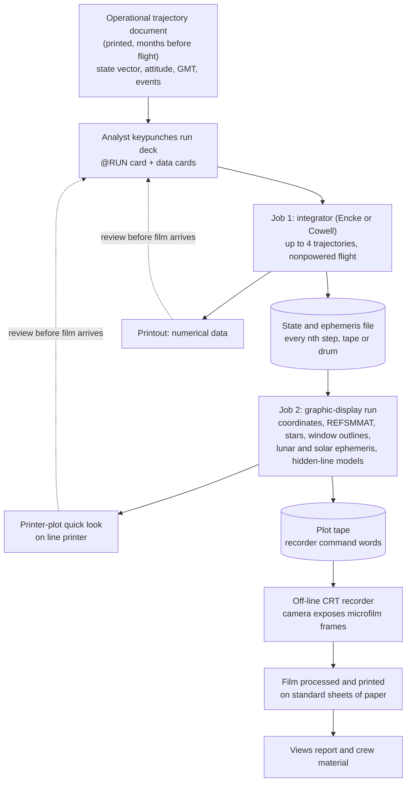

# How the VIEW program was most likely run as batch jobs

This page asks how the Apollo-era "view program" (MSC, UNIVAC 1108, FORTRAN V) was operated, and what that would look like as a sequence of batch jobs. It is evidence-first: section 1 is what the NASA reports say, section 2 is what the 1108/EXEC/S-C 4020 documentation establishes about batch structure, and only section 3 onward speculates.

Sourcing rule: every historical or technical claim carries a source (URL, or local file plus page). Anything that is our reasoning is labelled "Conjecture:". Where nothing was found the page says "not found" (collected in section 5).

Page references: TN D-6853 is cited by printed page (printed page N is PDF page N+5 of `reference/TN-D-6853_Hyle_Lunde_1972.pdf`). UE-637 and UP-4144 are cited by the "section, page" numbers printed in the scans (OCR is noisy and the footer position is sometimes ambiguous, so treat page numbers as +/- 1). MSC IN 69-FM-197 is cited by PDF page of `reference/MSC-IN-69-FM-197_Apollo11_views.pdf`.

## 1. What the reports establish

The program is described in NASA TN D-6853, by Hyle and Lunde (Manned Spacecraft Center, January 1972; local `reference/TN-D-6853_Hyle_Lunde_1972.pdf`). The quotes below are from that file, read directly.

- Platform and language, p.3: "The view program operates on the UNIVAC 1108 computer. The program is writ- ten in the FORTRAN V language, which can be converted easily to operate on other com- puter systems." (OCR hyphenation preserved).
- Two-part structure, p.3: "The program consists of two basic parts: the integrator portion and the graphic-display portion."
- Integrator, p.3: "The integrator portion uses either the Encke or the Cowell integration method and can integrate any nonpowered-flight trajectory after the initial state vector is known."
- Coupling between the parts, p.3: "To generate graphic displays, the numerical data that described the display must be available from the integrator portion of the program. The graphic data can be displayed at any nth value of the integration step."
- Output medium, p.3: "The graphic display consists of microfilm frames produced by a camera that photographs an image constructed on the surface of a cathode-ray tube. The image is formed by dots, and, depending on the segment desired, lines and curves may be produced by connecting the dots."
- Quick look, p.3: "Although the principal form of output is microfilm frames, numerical data, as well as crude printer-plot images of the data, may be requested. The numerical data and images are helpful because they provide for a quick-look evaluation before the microfilm frames are received. For most uses, the microfilm frames are printed on standard sheets of paper."
- Modification list, p.3: the changes to the original program "were associated with the input/output options, coordinate transformations, lunar- and solar-ephemeris installation, three-dimensional-display problems, and realistic spacecraft-window outlines."
- Origin, p.2: the program was "a somewhat dormant computer program" that "Originally ... was developed as an aid in the early Gemini rendezvous and docking studies." The machine it originally ran on is not stated (not found).
- Appendix, p.12: "As many as four vehicle trajectories can be integrated simultaneously"; window outlines come from "detailed engineering drawings"; there are two star catalogs (391 navigation stars, or 1078 stars to magnitude 4.5); hidden-line models of the LM and S-IVB; and "A planetary ephemeris, which gives the position of the Sun and the Moon with respect to the Earth, is produced."
- Inputs, p.12: "the vehicle position, velocity, and attitude and Greenwich mean time must be known. These data are obtained readily from the operational trajectory document, which is printed and available several months before each Apollo mission."
- Options, p.13: coordinate systems are "the Earth-fixed system, the Earth-centered inertial system, the selenographic system, and the body-axis system", with "an inertially fixed platform or a local-vertical platform".
- Products, p.11 (concluding remarks): the program's use "and a preflight report" fulfilled crew and ground familiarization, backup attitude checks, star selection, descent confirmation by crater motion, and landmark identification.

MSC Internal Note 69-FM-197, "Revision 1 to Views from the CM and LM during the flight of Apollo 11 (Mission G)", A. N. Lunde, 3 July 1969 (local `reference/MSC-IN-69-FM-197_Apollo11_views.pdf`, OCR in `reference/MSC-IN-69-FM-197_ocr.txt`):

- Who ran it, PDF p.24 (section 1.2): "The major analytical tool used to produce this report was developed by Mr. G. B. Roush of the Computation and Analysis Division." The note itself is from the Flight Analysis Branch, Mission Planning and Analysis Division (title page).
- It was re-run when the trajectory changed, PDF p.23-24 (section 1.1): the note "supersedes MSC IN 69-FM-168" and "Due to the recently added revolution prior to DOI, the g.e.t. changes by about 2 hours. This report reflects all changes that have been made to date, and conforms with the latest nominal mission profile." This is direct evidence that a set of views was regenerated as a batch when the input trajectory moved.
- Event and attitude tables, PDF pp.37-38: Table I is "SEQUENCE OF MAJOR EVENTS" (for example TLI at 02:44:18 g.e.t. with 321.0 s burn; LOI at 75:55:03; PDI at 102:35:xx (OCR-garbled); TEI at 135:24:30) and Table II lists the mission REFSMMATs (launch pad, PTC, lunar landing site, CSM preferred plane change, lunar lift-off, entry) as 3x3 matrices "listed in the following format xx xy xz / yx yy yz / zx zy zz". These are exactly the kind of event times and orientation matrices a run deck would need as input; the note does not say how they were fed to the program.
- Not stated: the note contains no description of program structure, job setup, tapes, film recorder or turnaround (searched the OCR for computer, program, tape, film, plot: only the "major analytical tool" sentence and the star-catalogue and REFSMMAT sections matched).

A closely related MSC report on how Apollo analysis programs were chained (not the view program): C. E. Allday, "Apollo experience report: Real-time auxiliary computing facility development", NASA TN D-6855 / MSC-S-326, June 1972 (https://ntrs.nasa.gov/citations/19720017573; PDF https://ntrs.nasa.gov/api/citations/19720017573/downloads/19720017573.pdf), printed pp.7-8:

- "During the mission, the programs were run in a batch-processing mode, which is similar to the premission planning mode." (p.7)
- "The trajectory ephemeris tape and the 200-Word Record were the automatic program interfaces that were used during the Apollo Program. The ephemeris tape contained position and velocity-vector data and spacecraft-attitude information for one or two spacecraft. This tape was written by the basic RTACF integrator (the Apollo Reference Mission Program), which had both free-flight and powered-flight capabilities. Other programs, such as optics computations and radiation-dose computations, that contained no integrator also used the ephemeris tape for input." (p.7-8)
- "job turnaround was improved and human errors were decreased significantly by having the computer transfer automatically from module to module, instead of having the inputs manually keypunched for each individual module." (p.8)
- "This data base, located on a FASTRAND drum (as were most of the programs themselves)" (p.8).
- Caveat: this report concerns the RTACF (Real-Time Auxiliary Computing Facility) and the mission-planning programs it inherited, not the view program; whether the view program used the same ephemeris tape is not found. It is included because the integrator-writes-tape, downstream-programs-read-tape pattern is documented for the same center and era, and the view program's own text (integrator data "must be available", "at any nth value of the integration step") describes the same coupling.

Trajectory document, what and who: the "operational trajectory" documents were MSC Mission Planning and Analysis Division publications, for example "Spacecraft Operational Trajectory for Apollo Mission F, Volume I - Operational Mission Profile" (26 March 1969, for the 17 May 1969 launch): https://www.nasa.gov/wp-content/uploads/static/history/afj/ap10fj/pdf/a10-sc-op-traj-rev1-vol1-mission-profile-1969-05-17-launch-19690326.pdf. Note: this URL was returned by a web search but returned HTTP 404 when fetched for this page, so the title, division and dates here are from the search listing only and were not read in the document. Its contents (whether it carries printed state vectors and attitudes in a form suitable for keypunching) are not found.

## 2. What the 1108 documentation establishes about batch structure

Sources: UP-4144 "UNIVAC 1108 Executive Programmer's Reference" 1966 (https://fourmilab.ch/documents/univac/manuals/pdf/1108/UP-4144_1108_Executive_Reference_Manual_1966.pdf, read locally) and UE-637 "UNIVAC 1108 Executive Users Guide" 1970 (https://fourmilab.ch/documents/univac/manuals/pdf/1108/UE-637_1108execUG_1970.pdf, read locally). Neither scan uses the name "EXEC 8" (they say "Executive"; `docs/univac-1108.md` already records the EXEC 8 naming). UE-637 is dated 1970, after the Apollo 8 view work (Dec 1968), so details below are what the system did at those dates; which Executive version and level MSC ran in 1968-69 is not found.

Batch definition and run structure:

- UE-637 sec. 1.2 (Definitions): "Batch Processing - A mode of operation where several runs are grouped prior to processing. Transition from run to run is effected by the Executive System."
- A run is one control stream. UE-637 sec. 2.6 (pp. 2-4 to 2-5): "The @RUN statement must be the first statement of a run." Format `@RUN,priority/run-options RUN-ID,Aactg,Project,run-time/deadline,pages/cards,start time`; options T, P, C terminate the run if the estimated time, pages or cards is exceeded; option S makes a run follow the preceding run on the same input device.
- The run ends at `@FIN` (UE-637 sec. 2.7): "The @FIN statement is used to signal that the end-of-run has been reached."
- Multi-step runs: UE-637 sec. 2.14 (p.2-34): "The XQT (Execute) Statement is used to initiate execution of an absolute program prepared by the collector." Several `@XQT` statements in one run execute several programs in order, with data cards following each `@XQT`.
- UE-637 sec. 3.6 (p.3-7), "Execute existing programs using catalogued data files", is the closest documented analogue to a two-program VIEW job: it runs `@XQT PROGFILE.MINT1` (reads data cards and a file, creates a temporary file `TEMP`), then `@XQT PROGFILE.MINT2` which "updates the file ... The temporary file created by MINT1 is used as the basis for the update." An `@FREE` between the steps "releases the file so that another run might gain exclusive access". The manual's sample project name in sections 3.4-3.6 is "APOLLO", which is a coincidence of example naming, not evidence.
- Control-stream include: UP-4144 sec. 5 (near p.5-18) describes `@ADD FILENAME` ("WHEN THE @ADD CONTROL STATEMENT IS ENCOUNTERED ... THE FIRST IMAGE OF THE ADDED FILE REPLACES THE @ADD CONTROL IMAGE"), including "HAVE WORKER PROGRAMS IN THE FIRST PART OF A RUN GENERATE FILES TO BE ADDED LATER IN THE RUN": a run can build its own later control statements from data written by an earlier program (OCR capitals as printed).
- Typical run with a tape: UP-4144 sec. 6 (around p.6-2) shows `@RUN AK4,888,OPTICS,5,15`, `@ASG,T ATMOS,T,A341`, `@FOR`, FORTRAN source, `@XQT`, data, `@PMD`, `@FIN` (OCR of the reel number is "A3~1"), and explains: "THE PROGRAM EXECUTED IS SUPPLIED DATA FROM THE CONTROL STREAM AND FROM AN INPUT TAPE OPTIC*ATMOS WHICH IS ON REEL A341." Data cards (control-stream) plus an input tape in a single run is therefore documented practice.

Compile, collect, execute:

- `@FOR` compiles FORTRAN source; option I inserts the source into a program file (UE-637 sec. 3.4, p.3-3 to 3-4). UP-4144 sec. 1 lists "FORTRAN V" among the source-language processors.
- The Collector: UE-637 sec. 5.1 (p.5-1): it "is a system processor designed to provide the user with a means of gathering (collecting) and interconnecting one or more relocatable elements to produce a program in a form ready to be loaded into memory and executed. This program form is called an absolute element."
- When `@MAP` is needed: UE-637 sec. 2.15 (pp. 2-35 to 2-36) lists (1) relocatables spread across several files, (2) "The program requires overlays (segments)", (3) structural ambiguities, (4) the absolute element is retained so re-allocation is not needed. Without an `@MAP`, "the system simulates the statement and calls the Collector on the occurrence of an @XQT control statement."
- Segments and overlays: UE-637 sec. 5.3.4 (pp. 5-10 to 5-11). "The first segment named in the source input is called the Main segment and is never overlaid by any other segment." `SEG NAME1,NAME2` with a blank NAME2 puts the segment after the previous one; "If NAME2 is present and is not inclosed in parentheses the NAME1 segment will start at the same location as NAME2 segment" (an overlay); parenthesised names start after the highest of them. A secondary segment is loaded "directly by the procedure call: L$OAD NAME,JUMP,CLEAR" (OCR of the routine name), or a segment named with a trailing asterisk is "loaded automatically when referenced by any jump command to an instruction area". `LIB` names program files searched before the system library (sec. 5.3.3).
- So on the 1108 the integrator and the display could equally have been (a) two absolute elements run by two `@XQT`s, or (b) one absolute element with overlaid segments. The documentation supports both; which one MSC used is not found (see Conjecture in section 3).

Files, tapes and drums:

- Mass storage: `@ASG,options NAME/KEY1/KEY2,TYPE/RESERVE/GRANULE/MAXIMUM` for FASTRAND drum files (UE-637 sec. 2.8, pp. 2-7 to 2-19, examples such as `@ASG,T FILEY,8C` and `@ASG,CR FILEX,F/5`); temporary files vanish at run end unless catalogued (`C`/`U` options).
- Tape: UE-637 sec. 2.9 (pp. 2-20 to 2-22): `@ASG,OPTIONS NAME/KEY1/KEY2,TYPE/UNITS/LOG/NOISE,REEL1/REEL2/...`; density options L (200 FPI), M (556), H (800); mode options include E even parity, B "Binary (No Translate)", I "Decimal (Translate FIELDATA to BCD on WRITE, BCD to FIELDATA on READ)"; type C means UNISERVO VIIIC, VIC or IVC; "the density is fixed at high, the parity is fixed at odd" for nine-channel units.
- Naming: a program refers to a file by an "internal" name of up to 12 characters that must point at an "external" name, automatically if the internal name equals the file part of the external name, or via `@USE` (`@USE CAT,BLACK*DOG`) (UP-4144 sec. 1 file names; UE-637 sec. 1.4.6 and sec. 2.11).
- FORTRAN V I/O to tape and drum, unit numbers, unformatted/binary records and how a FORTRAN unit maps to an `@ASG` file: not found (no FORTRAN V programmer's reference was located in the fourmilab or bitsavers 1108 directories; the Computer History Museum catalogues one, "UNIVAC 1108 FORTRAN V programmer's reference manual", 1966, 120 pages: https://computerhistory.org/collections/catalog/102799051, catalogue entry only). The `@ASG` binary mode option and internal-name mechanism above show how a tape file written by one step can be re-read by the next; the FORTRAN-side statements are not sourced.
- Operating cost of a "job": UE-637 sec. 2.6 shows run-time and page estimates on the `@RUN` card and that the Executive enforces them; turnaround times at MSC: not found.

The recorder side (S-C 4020, the only documented CRT microfilm recorder of the era that fits TN D-6853's description; MSC's recorder itself is not identified anywhere, see section 5):

- Brochure "S-C 4020 Computer Recorder", Stromberg-Carlson, Apr 1965 (https://ftp.mirrorservice.org/sites/www.bitsavers.org/pdf/strombergDatagraphix/brochures/S-C_4020_Computer_Recorder_Brochure_Apr1965.pdf, 4-page PDF): "The S-C 4020 is an electronic system capable of operating on-line with a computer or of accepting digital magnetic tape signals and converting binary or BCD codes into combinations of alphanumeric printing, curve plotting and line drawings. The 4020 records the information at high speeds on both microfilm and photorecording paper."
- Same brochure, tape path: "Six channel digital tapes are read at 200, 556 or 800 bits per inch. Compatible tape units include the IBM 729 II, IV, V, VI and 7330 plus UNIVAC IIIC, Collins, and others." A "Tape Adapter ... Accepts data from tape up to 90,000 characters per second. Assembles six-bit information from tape and arranges it into 36-bit words."
- Same brochure, host libraries: "The S-C 4020 output package consists of a set of programming subroutines for printing and plotting data on the S-C 4020. Packages are presently available for IBM 704, 7090, 7094, GE 225, CDC 160A, 1604, UNIVAC 1107 and other computers." No 1108 package is named. Also: hard-copy paper "quick look" camera (F165) makes a frame visible "2 1/2 seconds after exposure" in its internally processed mode, and the recorder can also record "on 35 or 16 mm film".
- "S-C 4020 Computer Recorder Programmer's Reference Manual", Stromberg-Carlson, Jun 1968 (https://ftp.mirrorservice.org/sites/www.bitsavers.org/pdf/strombergDatagraphix/SC_4020/9500056_S-C_4020_Computer_Recorder_Programmers_Reference_Manual_Jun1968.pdf, 166 PDF pages; local page markers), p.1-4: "Input to the S-C 4020 may be directly from the computer through an I/O adapter or from a tape unit which is off-line. When operating off-line, an F-53 buffer is normally used to control the tape drive and to convert tape records to 36-bit control words for the S-C 4020." Pp. 3-4 to 3-5: the host library buffers command words in core and writes the buffer to an output tape when full; "the last command of any program using the S-C 4020 programming system must be a CALL PLTND followed by a statement to write an END OF FILE on the output tape"; the output tape is selectable with `CALL TPNUMV(LOGNUM)`. That manual documents the library for IBM 7090/7094 (FORTRAN II and IBJOB); it does not describe a UNIVAC 1108 version.
- Prior project note: `docs/univac-1108.md` already gives the on-line versus off-line rates and the same not-found for an 1108 plotting library.

## 3. Conjecture: a plausible VIEW job sequence

Conjecture: everything in this section is our reconstruction from sections 1 and 2; none of it was found in a source. The sourced pieces are the two-part program (integrator and display), the "nth step" data hand-off, the microfilm-frames-then-paper output, the numerical and printer-plot quick look, and the 1108 mechanisms that make a multi-step tape-coupled run possible.

Conjecture on structure: the integrator and the graphic display were separate FORTRAN V main programs or overlay segments, coupled through a file (tape or FASTRAND) holding, at every nth integration step, the vehicle state, the ephemeris of Sun and Moon, and attitude; TN D-6853's "must be available from the integrator portion" and "at any nth value" read naturally as a written-out step table. The Allday report (section 1) documents exactly this integrator-writes-ephemeris-tape pattern for related Apollo programs at MSC, which raises but does not prove the likelihood. The alternative (one program, integrator called as a subroutine per step, display drawn inline) is also consistent with the text; we prefer the file-coupled reading because the same integrator output feeds the numerical listing, the printer plot and up to four trajectories.

Conjecture on operation: an analyst keyed a small deck from the operational trajectory document (initial state vector, attitude, GMT, event times, REFSMMAT choice, catalogue choice, coordinate system, platform option, window outline selection, nth-step frequency), submitted it to the batch queue, got the printout and printer plot back within the day, and later received the developed microfilm, which was printed on paper for the report. When the mission profile changed (as with the recently added revolution before DOI in IN 69-FM-197 rev 1), the deck was edited and the whole set of view runs re-submitted.



Sample EXEC-style runstream. Illustrative, written in the style of UE-637 and UP-4144 examples; it is not a recovered deck. Every control statement form is taken from the examples in section 2, but the `@COMMENT` and `@REWIND` lines are not verified against the manuals (`@REWIND` appears in the UE-637 contents, sec. 4.15), and the file names, tape reel numbers, option letters on `@MAP`, and the account and run identifiers are invented, and how FORTRAN V programs bind their unit numbers to these files is not sourced (so it is shown as a comment). The two-step structure follows UE-637 sec. 3.6 (two `@XQT`s sharing a temporary file) and the tape assignment follows UE-637 sec. 2.9 and the UP-4144 sec. 6 example.

```
@RUN   VIEW01,J71104,APOLLO,20,300
@COMMENT   -- ILLUSTRATIVE ONLY, NOT A RECOVERED DECK --
@ASG   VIEWPGM/READK                   PROGRAM FILE WITH COLLECTED ABSOLUTES
@ASG,T EPHTAP,T,A201                   STATE/EPHEMERIS TAPE, OUTPUT OF STEP 1
@ASG,T PLTTAP,T,A202                   RECORDER PLOT TAPE, OUTPUT OF STEP 2
@COMMENT   -- STEP 1: INTEGRATOR --
@XQT   VIEWPGM.INTEG
  ...  DATA CARDS: GMT, POSITION, VELOCITY, ATTITUDE, EVENT TIMES,
  ...  METHOD (ENCKE OR COWELL), STEP, NTH-STEP OUTPUT FREQUENCY
@REWIND EPHTAP
@COMMENT   -- STEP 2: DISPLAY --
@XQT   VIEWPGM.DISPLAY
  ...  DATA CARDS: REFSMMAT, COORDINATE SYSTEM, PLATFORM OPTION,
  ...  STAR CATALOG CHOICE, WINDOW OUTLINE, VIEW LIST, QUICK-LOOK REQUEST
@FIN
```

If the two parts were segments of one absolute element, the collect step would replace the second `@XQT`. A shape consistent with UE-637 sec. 5.3 (again invented names, `@MAP` options unverified):

```
@MAP,L VIEWPGM.VIEWABS
IN     VIEWPGM.DRIVER
SEG    INTEG
IN     VIEWPGM.INTEG,VIEWPGM.ENCKE,VIEWPGM.COWELL
SEG    DISPLY,INTEG                    STARTS AT THE SAME LOCATION: OVERLAYS INTEG
IN     VIEWPGM.DISPLY,VIEWPGM.STARS,VIEWPGM.WINDOW
@XQT   VIEWPGM.VIEWABS
```

Conjecture on hand-off: the plot tape is written in the recorder's tape format (six-channel, 200/556/800 bpi per the S-C 4020 brochure; command words assembled 6-bit into 36-bit words), mounted on a tape unit attached to the recorder or its F-53-style adapter, not on the 1108. This is the standard off-line arrangement documented for the S-C 4020 (Programmer's Reference Manual p.1-4). The 1108 side of it (which plot library, whether the 1108 wrote a binary "B" mode tape, character translation) is not found.

## 4. Mapping to this reconstruction, and a design idea for a batch mode

Facts about this project come from the README (`/home/aaron/Projects/games/sim/nasa-view/view1108/README.md`) and are not restated here beyond what the mapping needs.

Mapping (this is our own framing, not sourced):

- Our display kernel plays the part of TN D-6853's "graphic-display portion": it takes vehicle state, attitude, time, and coordinate and star-catalog choices and produces frame geometry.
- Our analytic stand-in (a closed-form or simple propagation) plays the part of the "integrator portion" for the states the display consumes; it is not an Encke or Cowell integrator and is not claimed to reproduce MSC's numbers. Where the reports print real states (operational trajectory document, IN 69-FM-197 events), a faithful run would feed those as the initial state vector instead.
- The web page plays the part of the recorder plus film: the CRT, camera and paper print collapse into one raster.
- What the two-job structure of section 3 gives up when collapsed: the intermediate step file (no "every nth step" artefact), the separate printout and printer plot, and the delay between them and the film.

Design idea (not a requirement; labelled as such): a "batch mode" that makes the historical structure visible.

- Input is a run deck, a short text file in the style of the sample above: `@RUN` card, an integrator data block (state vector, GMT, attitude, events, nth-step), a display data block (REFSMMAT, coordinate system, platform, catalog, window, view list). The page parses it and rejects a malformed deck with a period-style message.
- Job 1 runs the stand-in propagation and emits a numeric listing and a step table (the "ephemeris tape"), shown as a printout.
- Job 2 reads the step table, renders each requested view, and first shows only the printer-plot quick look (crude character-cell rendering, cf. TN D-6853 p.3), as the analyst would have had first.
- The film strip appears afterwards: frames are exposed one by one at a simulated recorder rate and then "developed" after a delay. Rates would come from documented figures (brochure: microfilm recording at 12,000 characters per second from tape; "an average annotated graph can be recorded in a fraction of a second"; F165 hard copy visible 2 1/2 seconds after exposure) and must be labelled as S-C 4020 figures, since MSC's recorder is not identified. The 1108's own time would be modelled from the machine timings already collected in `docs/univac-1108.md`, with any turnaround delay chosen for effect and labelled invented (real MSC turnaround: not found).
- Output is a film strip of frames (one per view, with frame counter) that can then be "printed on standard sheets of paper" as a contact sheet, matching the report's presentation.
- Guard rail: keep the current interactive mode as the default; batch mode is an additional way of presenting the same kernel and should not imply that the numbers come from an 1108.

## 5. Not found

- Which recorder MSC used with the view program (S-C 4020 is our documented stand-in, not an identification); its tape format as used from the 1108; any 1108 or MSC in-house plotting library (the brochure lists a UNIVAC 1107 package but none for the 1108).
- Whether the integrator and display were separate programs, segments of one program, or one program with an intermediate file: the reports say only "two basic parts".
- Any MSC description of the view program's job setup, run deck, control cards, tapes, files, or of Computation and Analysis Division batch operations, queue policy or turnaround times for this program (the Allday report gives only the general statement that programs were "run in a batch-processing mode" and that automatic module-to-module transfer improved "job turnaround").
- Which Executive level (EXEC II, EXEC 8 release) ran at MSC in 1968-69; the 1966 and 1970 manuals used here bracket that time but do not say.
- FORTRAN V I/O statements to tape and drum (unit numbers, unformatted/binary records, how units bind to `@ASG` files): no FORTRAN V programmer's reference was found online; only a catalogue entry at the Computer History Museum.
- The contents and format of the operational trajectory document (the search listing gives its publisher as the Mission Planning and Analysis Division; the fetched URL returned 404, so nothing was read), and whether its numbers were keypunched by hand or transferred electronically to the view program's input.
- Whether the view program read the RTACF-style trajectory ephemeris tape.
- Origin machine and language of the pre-Apollo Gemini-era version of the program (TN D-6853 p.2 says only "somewhat dormant").

## 6. References

1. NASA TN D-6853, Hyle and Lunde, 1972, local `reference/TN-D-6853_Hyle_Lunde_1972.pdf` (pp. 2, 3, 11, 12, 13 read for this page).
2. MSC IN 69-FM-197 rev 1, Lunde, 3 July 1969, local `reference/MSC-IN-69-FM-197_Apollo11_views.pdf` and `reference/MSC-IN-69-FM-197_ocr.txt`.
3. C. E. Allday, Apollo Experience Report: Real-Time Auxiliary Computing Facility Development, NASA TN D-6855 / MSC-S-326, June 1972: https://ntrs.nasa.gov/citations/19720017573
4. UP-4144, UNIVAC 1108 Executive Programmer's Reference, 1966: https://fourmilab.ch/documents/univac/manuals/pdf/1108/UP-4144_1108_Executive_Reference_Manual_1966.pdf
5. UE-637, UNIVAC 1108 Executive Users Guide, 1970: https://fourmilab.ch/documents/univac/manuals/pdf/1108/UE-637_1108execUG_1970.pdf
6. Stromberg-Carlson, S-C 4020 Computer Recorder brochure, Apr 1965: https://ftp.mirrorservice.org/sites/www.bitsavers.org/pdf/strombergDatagraphix/brochures/S-C_4020_Computer_Recorder_Brochure_Apr1965.pdf
7. Stromberg-Carlson, S-C 4020 Computer Recorder Programmer's Reference Manual, Jun 1968: https://ftp.mirrorservice.org/sites/www.bitsavers.org/pdf/strombergDatagraphix/SC_4020/9500056_S-C_4020_Computer_Recorder_Programmers_Reference_Manual_Jun1968.pdf
8. Spacecraft Operational Trajectory documents (search listing only, fetch failed): https://www.nasa.gov/wp-content/uploads/static/history/afj/ap10fj/pdf/a10-sc-op-traj-rev1-vol1-mission-profile-1969-05-17-launch-19690326.pdf
9. Computer History Museum catalogue entry for the 1108 FORTRAN V programmer's reference (entry only, not the manual): https://computerhistory.org/collections/catalog/102799051
10. Project pages: `/home/aaron/Projects/games/sim/nasa-view/view1108/README.md`, `/home/aaron/Projects/games/sim/nasa-view/view1108/docs/univac-1108.md`.
