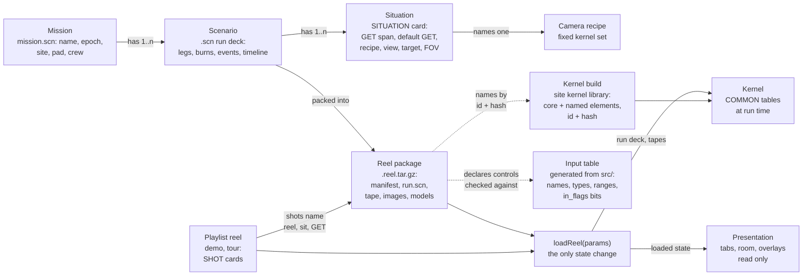

# Systems model: mission, scenario, situation, reel, presentation

This page is the design for how VIEW-1108 decides what it shows. It extends [`docs/vision.md`](vision.md) ("Missions as reels", one engine and many scenarios) and does not repeat it. It is written for maintainers and future agents: the first half explains the model and its rules, the second half is reference (package layout, directory tree, migration order). The agreed design and its evidence are in GitHub epic #15 and issues #16-#27; where they differ, the later issue wins: #26 (the reel package) over #18 and #23, and #27 (operator interaction) for stations and divergence.

Sourcing follows `CLAUDE.md`: UE-637 (UNIVAC 1108 Executive Users Guide, 1970, https://fourmilab.ch/documents/univac/manuals/pdf/1108/UE-637_1108execUG_1970.pdf) is cited by its printed section and page, as in `docs/batch-pipeline.md`; historical claims cite a document the repo holds, by printed page; our design choices are labelled "ours"; our reasoning about the period is labelled "Conjecture:". Almost everything below is design, so it is ours unless a source is given. File:line references are to the tree at `f8ef1ee` and will drift as the migration lands.

## 1. The application

What the viewer meets, from the outside in. The layers and the station table are the user's direction in #27; the arrangement is our design.

| Layer | What it is | Kind |
|---|---|---|
| **The lab** | The machine room: the place, and the navigation. The viewer moves between stations instead of between menus | ours; set dressing from period 1108 photographs (#21) |
| **Stations** | Pieces of equipment, each with one purpose (table below) | ours |
| **The reel** | The scenario that is loaded: one mission's run deck and tape, or a playlist (section 3, section 5) | ours as a package; the run deck stands for VIEW's per-mission input (TN D-6853 printed p. 12) |
| **The kernel** | VIEW: an engine flying the scenario's real maneuvers (`src/sim.f` through the BURN cards, `docs/simulation.md`), plus the view side that draws what the crew would see. TN D-6853 printed p. 3 names the two parts, "the integrator portion and the graphic-display portion" | VIEW material where sourced; flying the maneuvers is ours |
| **The operator** | Our modern reading of what a viewer can do with VIEW: move the camera's origin and target, see the block interiors around the design eye, and interact with the maneuvers by diverging from the master tape (section 7) | ours, fenced RESTOMOD in the kernel |

### Stations

From #27. This is the one declared equipment→purpose table that #20 asks for (section 6). It drives both presentations: in the room a station is equipment you walk to; in Tabbed the same row is a tab or panel (#27, requirement of 2026-10-06). The rows built so far are code: `STATIONS` in `web/lab/src/stations.ts` (#20; section 6 says what reads it). The shelf row is built (#19 slice b: the tape rack, a `shelf` station, and Tabbed's reel list, opened by the sim panel's Return to reels since #73); the clock row is not in it yet. The drive's Tabbed panel is, for now, only the Time group's DEMO label: Play restarts a demo the drive stopped, but Pause on a running demo takes control into Free-look, so Tabbed has no plain STOP of the demo yet (rule 7 is not met for this row).

| Station | Purpose | Tabbed (tab or panel) |
|---|---|---|
| Tape library shelf (#19) | choose a reel: pull it, then load it from its modal (or carry it to a drive) | reel list (the sim panel's Return to reels opens it, #73), each reel with a notebook followed by Read the notebook |
| UNISERVO drive | shows the mounted reel; the demo reel when idle (#18, #20) | mounted-reel status, start and stop |
| Graphical console (1558 vector terminal) | dynamic interaction: fly, look, change camera origin and target, diverge | plot view |
| Glass terminal | inspection: the FORTRAN source (as now) and the loaded tape (run deck, states, events, burns, divergence point) | source and tape inspection |
| Microfilm recorder | takes the current scenario state (master or work tape, a GET or a span) and records or prints it (as Print does now) | print |
| Line printer | kernel listing | listing |
| Bookcase | reference library; the mission notebooks (#29), each paired with its reel | library (its list also holds the mission notebooks) |
| Console / reel-table clock | Houston time and GET of the mounted reel | status line |

**Tabbed is a full peer of the room**, for usability and on phones (#27). Both presentations are generated from this one table and call the same `loadReel`, so neither has a capability the other lacks (rule 7). Tabbed stays the default where WebGL is unavailable or the screen is narrow, as today: the room runs only when the lab is supported and a wide-screen media query matches (`web/src/room.js:10`, `:142`), and a link naming a view opens Tabbed for that visit (`room.js:15-16`).

The two presentations are named **Room** and **Tabbed** (the user's naming, 2026-10-06; the code and the earlier issues call the second one "Tiled"). Tabbed's tabs are the existing navigation bar at the top of the page. The Room/Tiled button becomes Room/Tabbed, and the URL key becomes `space=room|tabbed`, with `space=tiled` accepted as an alias that carries a removal note, like the other renamed keys (#22).

**Only the shelf and the drive change what is loaded**, in the room or as the reel list and drive panel in Tabbed. Mounting a reel is the one way to change the reel. The graphical console changes time, look and the work tape inside the mounted reel, through the same loaded-state object and `loadReel` (rule 1). Arriving at a station, opening it or leaving it changes nothing (rule 2). The other stations read the loaded state and never write it.

## 2. Problem

What is simulated is decided in many places, and some of them disagree.

- **Mission identity takes five forms:** the MISSION card of each mission folder (`data/missions/apollo11/mission.scn:25`, `data/missions/apollo8/mission.scn:13`); the `mission` column (8, 11) of `data/photos.tsv`; `SCENE_MISSION = { 9: "APOLLO 8" }` (`web/src/views.js:11`; resolved by #17: the page reads each situation's mission from `VIEW_NAMES.SITUATIONS`); `LIFTOFF_MS`, fixed to Apollo 11 (`web/src/lettering.js:4`), with the epoch offset read back from `hdr(16)` (`web/src/kernel.js:59-60`); and `A11_RANGE_ZERO` plus `A8_OFFSET` keyed on scene 9 (`web/lab/src/equipment/console4009.ts:56`) (the last two resolved by #16: the page and the room read the loaded scenario's mission, epoch and range zero from `VIEW_NAMES.SCENARIOS`, through the loaded-state object and `LabState`).
- **The scene→scenario map is written four times:** `DATA ISNSC` (`src/vdrive.f:82`; resolved by #17: the SITUATION cards carry it), `SCENE_SCENARIO` (`web/src/timeline.js:4`; resolved by #17), `SCN` (`tools/selftest.mjs:49`; resolved by #17: both read the generated situations) and `replayUTC` (`console4009.ts:56`; resolved by #16: it adds the g.e.t. to the loaded scenario's range zero).
- **The scene list is written five or more times:** `SCENES` (`web/src/config.js:9`) plus runtime pushes for scenes 8 and 9 (`web/src/views.js:44-56`; both resolved by #17: the page reads the generated situations, since #26 slice 7d from each scenario reel's `page.json`); `tools/selftest.mjs:49` (resolved by #17); `Makefile:7`, which has drifted to `1 2 3 4 5 6 7 8`; the key hint at `web/page.template.html:141`, patched at runtime (`views.js:58`; resolved by #17: filled from the situation count); and the README, which still says 1..6.
- **Scenes are hard-coded in the kernel:** the 1..9 clamp in `VINIT` (`src/vdrive.f:93`), 25 `ISCN .EQ. n` branches in `vdrive.f` and 10 in `vview.f`, more in `lvlab.f`, `pen.f` and `lmoon.f`, and the layer lists `LL(12,9)` (`src/vlayer.f:36`). Resolved by #17 (PR #32): the kernel reads the SITUATION cards' tables and tests no scene number (the counts were 45 `ISCN` tests and 8 on `ICAM`).
- **Phase is three tables at three granularities:** `PHASES` (`web/src/modes.js:33`) and `JUMPS` (`modes.js:39`), both Apollo 11 only, and `TL_SCENES` (`web/src/timeline.js:54-107`), per scenario. Resolved by #17: all three are read from the scenario decks' `SPAN` cards (LIVE, JUMP and FOLLOW tracks).
- **Scenario facts live outside the scenario files:** `BURN_CUES` (`tools/gen_data.py:179-210`) and the string `"APOLLO 11 LANDING SITE"` (`gen_data.py:625`).
- **Shot lists are tied to scene defaults** (resolved by #18): Attract and Tour were scene numbers plus offsets from each scene's default g.e.t. (`modes.js:15-30`, `:65-72`; `ATTRACT8`, `TOUR8`, `TOUR9` pushed in at `views.js:54-56`), so retuning a default moved the shots. They are now the demo and tour playlist reels, `data/reels/demo/run.scn` and `data/reels/tour/run.scn`, whose SHOT cards name absolute g.e.t.s, played by one player (`web/src/player.js`).
- **Presentation changes state as a side effect.** `setTab` starts a mode: Simulate starts Live, Review starts Tour, Print or Fusion starts Free-look out of Attract or Tour (`web/src/tabs.js:11-22`). Room arrival calls it (`web/src/room.js:129-131`), so walking up to a terminal can change mode, scene and clock during the camera flight. Six paths set the scene: scene buttons and keys (`web/src/controls.js:112`), the Attract/Tour shot lists (`modes.js` `autoStep`), Live's `PHASES`/`JUMPS`, Following via `TL_SCENES` (both now from `SPAN` cards, #17), the Fusion photo pick (`web/src/fusion.js:44`) and the URL (`web/src/link.js:47`). Resolved by #16: `setTab` and room arrival only show (`web/src/tabs.js` `setTab`), and all six paths build params and call `loadReel` (`web/src/loader.js`), which alone writes the loaded-state object (`web/src/state.js` `LS`).
- **The room restates one mapping five times** (`ROOM_OPENS`, `roomOver`, `roomTermOf` at `room.js:51-54`; the `Opens` type at `web/lab/src/types.ts:6`; `AT_HINT` at `web/lab/src/lab.ts:48-51`; hover labels at `web/lab/src/room/room.ts:148-152`), and Esc has seven handlers whose meaning depends on order (`room.js` three times, `lab.ts` `onKey` and `onKeyCapture`, `web/src/library.js:69`, `web/src/printout.js:72`). Resolved by #20: the station table is declared once (`web/lab/src/stations.ts`) and the rest read it, and Esc is one stack (`web/src/esc.js`); section 6.

The cost shows when adding a mission. An Apollo 17 LM-descent view today touches about 16-18 files across FORTRAN, Python, JavaScript, TypeScript and docs: a new `.scn`; `gen_data.py` (`BURN_CUES`, `SITECH`); `vdrive.f`, `vlayer.f`, `vview.f` and possibly `pen.f`, `lvlab.f`, `lmoon.f`; `config.js`, `views.js`, `timeline.js`, `modes.js`, `controls.js`; `console4009.ts`; `page.template.html`; `selftest.mjs`; `Makefile`; `photos.tsv`; and `CLAUDE.md`, `README.md`, `docs/modes.md`, `docs/vision.md` (#23).

## 3. Model

Five concepts. Four describe what is simulated; the fifth only shows it.

| Concept | What it is | Source of truth | Owner at run time | URL key |
|---|---|---|---|---|
| **Mission** | Identity: name, range zero (epoch), landing site, launch pad, crew | The MISSION card in `data/missions/<id>/mission.scn` | the loaded-state object, set by `loadReel` | `mission=` |
| **Scenario** | One run deck for that mission: as flown, pre-flight nominal, a later revision; legs, burns, events, timeline | A `.scn` file in the mission folder | the kernel's scenario COMMON, written by `loadReel` | `scn=` |
| **Situation** | A named span of a scenario plus a camera recipe: g.e.t. span, default g.e.t., recipe, view, target, FOV, window, overlays | SITUATION cards inside the scenario `.scn` | the loaded-state object | `sit=` (with `get=` and the look keys) |
| **Reel** | Anything loadable: a package (`.reel.tar.gz`) with a manifest and a `.scn` run deck, plus tapes, images and models. It names the kernel build it runs on and declares its controls; it never carries code. A scenario reel carries one scenario; a playlist reel carries a playlist `.scn` of shots | The package, packed from `data/missions/<id>/` or `data/reels/<id>/`; or a private package from the viewer's disk | `loadReel` | `reel=` |
| **Presentation** | How the loaded state is shown: tab, Room or Tabbed, room equipment, overlays (library, listing), film effects | Page and lab code; per-viewer preferences | page and lab | `tab=`, `space=` |

The loaded-state object is one record: reel, mission, scenario, situation, g.e.t., look, playback position. The page and the lab read it; only `loadReel` writes it. Today's `LabState` (`web/lab/src/types.ts:9-17`, carrying `tab`, `mode`, `get`, `scene`) is where it starts: it gains reel, mission, scenario and epoch and loses `scene` (#16). Done by #16 except the reel, which #26 slices 7d and 7e add (`LS.scn` the scenario reel, `LS.deck` the one whose decks the kernel holds, `LS.reel` the mounted playlist reel): the page's object is `LS` (`web/src/state.js`), written only by `loadReel` (`web/src/loader.js`) and, for continuous changes, `track()`; `LabState` carries its situation, scenario, mission, epoch and range zero.



### Mission

A mission is identity and nothing else: what the lettering, the status line, the Houston clock and the photo index need to agree on. It is written once, in `data/missions/<id>/mission.scn`, and copied by the packer into every reel of that mission. The five forms in section 2 are all derived from it. The `mission` column of `photos.tsv` becomes the mission id, and photographs move into the reel that uses them (section 5).

### Scenario

A scenario is what `docs/vision.md` already calls a run deck: one trajectory version of one mission. Today's `.scn` cards (epoch, `SITE`, `PAD`, legs, `EVENT`, `TIMELINE`, `BURN`, `REF`) stay; `BURN_CUES` and `SITECH` move into cards. A mission folder can hold several scenarios, for example Apollo 11 as flown and the pre-flight nominal, and each packs into its own reel.

### Situation

A situation is the unit a viewer picks: "Apollo 8 Earthrise", "Apollo 11 LM descent". It replaces the scene number, `PHASES`, `JUMPS` and `TL_SCENES` (#17). It is a card in the scenario `.scn`, cited like every other card, so the mission → phase selector of `docs/vision.md` becomes mission → situation. The page's lists, Live's phase spans, the Following camera script and the selftest's list are all generated from these cards.

### Camera recipes

The kernel keeps a small fixed set of camera recipes, the parts of today's scenes that are genuinely different camera code. A situation names one recipe and supplies the mission facts (times, vehicles, targets, the pose of its models) as data; the kernel no longer branches on scene numbers. #17 first named six recipes; the survey of the kernel for #17 found five, because COAS is an overlay layer and "external" is a view (`in_view` 1) applied after any recipe, not camera code. A recipe is a platform plus a reference-attitude rule; `in_view` (window, external, CM station, LM station) and `in_target` are operators `VIEWPT` applies after it, in the order `SCNCAM`, `SCNMOD`, `VIEWPT`, `LOOK`. The two platform names echo TN D-6853 (printed p. 13): "an inertially fixed platform or a local-vertical platform" (as quoted in `src/vview.f`); the rest of the set and all the names are ours.

| Recipe | Parameters | Situations (today's scenes) |
|---|---|---|
| `LOCALVERT`, local-vertical platform | body; FORWARD (elevation above the horizon, azimuth turned to the Earth's sightline, an optional reference turn, an optional off-leg fallback to the Earth) or NORMAL (along the orbit normal) | 1 Earthrise (Moon, FORWARD, Earth azimuth); 3 Earth limb (Earth, FORWARD, +8°); 4 LM rendezvous (Moon, NORMAL); 9 Apollo 8 Earthrise (as 1, plus the fitted turn and the Earth fallback off the lunar legs) |
| `INERTIAL`, inertially fixed platform | attitude from the Earth's sightline (event, fix and drift times, offset) or from a vehicle's held attitude (`S7ATT`) | 2 Earth approach (sightline); 7 transposition and docking (`S7ATT`; the COAS is its layer 7) |
| `CREWSTN`, a crew station | vehicle, CM or LM: its design eye, window and cabin, and the vehicle it rides | 5 LM descent (the LM on `LMDESC` axes). The CM and LM stations of `in_view` 2 and 3 are the same geometry on a placed vehicle; a situation cannot yet name the CM as its own camera, for want of an axes source |
| `BODYCTR`, body-centred | body, altitude; yaw and pitch move the sub-observer point; ignores view and target | 6 Moon view |
| `EXTSEED`, external view seeded on a vehicle | vehicle attitude (`S8ATT`), seed distance, its far side from the Earth | 8 docked stack (its default view is external) |

`LOCALVERT` keeps three code paths (about the Moon FORWARD, about the Moon NORMAL, about the Earth FORWARD) and `INERTIAL` two, so every frame stays byte-identical to the scene code they replace (`make golden-check`). The poses (`LMPIRO`, `S7POSE`, `S8POSE`) stay kernel routines that a SITUATION card names by id; they are time laws with sourced or labelled constants, not data.

Today's nine scenes are nine situations with their current defaults, and every frame renders identically (the gate in section 9). The cards are in the scenario decks (`data/missions/<id>/*.scn`, the SITUATIONS section of the Apollo 11 deck lists the card types); a situation's ID is its number in its scenario reel, 1..N, and the kernel's `view_init` argument and `hdr(7)` while that reel's decks are loaded (#26 slice 7e; until then one numbering ran across both scenarios, Apollo 8's Earthrise being 9). Outside the page a situation is named by its reel and ID or NAME (`scn=`, `sit=`); the page's legacy `scene=N` still counts the situations across the reels in load order. The kernel's card reader (`src/vdeck.f`, #26) reads them into the situation tables at load; `tools/gen_data.py` checks them and writes `build/scenes.json` and the page's copy into each scenario reel's `page.json` (`build/page/<reel id>.json`, #26 slice 7d). The page's time scripts are `SPAN` cards in each scenario deck (the SPANS section of the Apollo 11 deck lists the format): FOLLOW spans are the timeline's camera (Following and the event jumps), LIVE spans Live's phases, JUMP spans Live's jump buttons and PIN spans the situations Live pins when picked; they are generated into the reel's `page.json`, and `PHASES`, `JUMPS` and `TL_SCENES` are read from them. Live's phases and the Following spans stay separate tracks because they cut the mission differently (Live is coarser and pins the windowed situations).

### Reel

A reel is the only thing that can be loaded. #18 and #23 first said "a reel is a `.scn` file"; #26 refines that to a package with the `.scn` inside, and this page follows #26. There are two kinds:

- **Scenario reel**: one scenario's run deck with its situations (one reel per scenario: `apollo11-asflown`, `apollo8-asflown`; decision on #26, 2026-10-07), and later its tapes, images and models.
- **Playlist reel**: a playlist `.scn` of a REEL card and SHOT cards, each shot naming a situation by its scenario reel and ID or NAME (`REEL=`, `SIT=`; #26 slice 7e), an absolute g.e.t. and look parameters (#18; `data/reels/demo/run.scn` documents the format). Shots use absolute g.e.t., not offsets from a default, so retuning a situation's default does not move them. The one time resolved at run time is ERFIND's Earthrise (`ERISE`±offset), which the kernel computes and exports (`out_terise`).

**Attract is the demo reel.** It is a hypothetical demonstration of the system, packaged and loaded like any other playlist reel, and it is the default reel mounted when the viewer has not chosen one, both on page load and in the room (#18, refinement of 2026-10-06). Tour is another playlist reel. There is one playlist player (`web/src/player.js`), and leaving the demo means loading a different reel. As built by #18: `reel=demo` and `reel=tour` mount the reels, and `mode=attract` and `mode=tour` are aliases that mount them too (each REEL card's ALIAS). "attract" and "tour" remain the page's internal mode names for the two mounted reels (`LS.mode`, beside `LS.reel`), and the mode buttons and link writer still use them. Captions, the room's display and the TOUR tag read the mounted reel's card (FILM, TAG), not the mode name. What remains to remove: the alias as a mode (`LS.mode` would be one "reel" mode with `LS.reel` saying which), the mode buttons and `TAB_OF` entries keyed by alias, and the link writer's `mode=` for a reel (#22). The film's four-shot sequence (`CLAUDE.md`, "Attract loop") is the first four shots of the demo reel.

How the viewer leaves the demo is ours and open (section 10): the proposal is that the first input that takes control loads the scenario reel of the shot on screen, at the current g.e.t. and look, so the picture does not jump.

### Presentation

Presentation is the tab bar, Room or Tabbed, the room's equipment and camera flights, the overlays, the film effects and the sound. It reads the loaded state and never writes it. Live, Free-look and Beam remain ways of driving time and look within a loaded situation; choosing a tab does not start any of them (section 4).

## 4. Rules

1. **One loader.** `loadReel(params)`, taking a `URLSearchParams`-like object, is the only code that changes reel, mission, scenario, situation, g.e.t. or look. The URL, keys, buttons, the Fusion photo pick, Live, the playlist player and the room shelf all build params and call it (#16). `applyParams` (`web/src/link.js:47`) stops reading the global `UP` and becomes the parser `loadReel` uses (done by #16: it is `loadLink` in `web/src/loader.js`, which `openLink` in `web/src/link.js` calls with the URL's params). Continuous changes inside a situation (the clock running, a drag of the look) go through the same object without reloading the reel.
2. **Presentation never changes mode, scene or time.** `setTab`, room arrival, walk-up, overlays and Esc change only what is shown. Done when opening any tab or room terminal leaves the loaded state unchanged (#16).
3. **No scene numbers in the page loops.** The playback loop, Live, Following and the keys read situations from the loaded reel. Done when `modes.js` has no scene numbers and grepping for `=== 9`, `{9:`, `ISNSC` and `A8_OFFSET` outside generated tables finds nothing (#16, #18).
4. **Every fact has one source, generated outward.** A fact is written once, in a card in `data/`, and the packer generates everything else from it: the reel's `run.scn` and tables, the site reel index, `build/names.js`, the selftest's list. No list of missions, situations or reels is typed by hand in page, lab, kernel, tests or Makefile.
5. **Everything loadable is a reel package with a `.scn` run deck inside, read at run time** (#26). The demo reel is no exception.
6. **Reels reference and declare; they never carry a copy of code** (decision on #26, 2026-10-06). Three consequences:
   - **Kernel by reference.** A reel's manifest names the kernel build it runs on from the site's kernel library, by id and hash. Period parallel: an EXEC 8 run named its program with `@XQT`, whose element field "names the specific element (absolute element only) to be executed" (UE-637 sec. 2.14.2, p. 2-34).
   - **One kernel core, no forks.** New capability, such as #24's contour terrain, is a new element in the one `src/` tree. A kernel build is the shared core plus a named set of elements, linked as the Collector gathers "one or more relocatable elements to produce a program" (UE-637 sec. 5.1). There is no per-reel FORTRAN.
   - **Controls as declared options.** The kernel publishes its input table (names, types, ranges, `in_flags` bits), generated from source. A reel's manifest lists which inputs to expose and how, from a closed vocabulary; the page owns the widgets and validates the reel against the input table at load. Period parallel: `@XQT` option letters "generate a 26 bit mask with bit position 25 set to a 1 bit for an A option letter, bit 24 for a B, etc." (UE-637 sec. 2.14.1), which the program read through `ER OPT$` (same section); `in_flags` is that mask today.

7. **Two presentations, one table.** The room and Tabbed are both generated from the station table (section 1) and both call the same `loadReel`. Anything a viewer can do at a station in the room can be done on its Tabbed tab or panel, and the reverse (#27). A capability added to one is added to the row, not to a presentation.

Rules 4 and 6 together: mission, scenario and situation data live only in the run deck; kernel tables, page names, the input table's page copy and the shelf index are generated from the deck or from `src/`.

## 5. Reel package

### Layout

From #26; the file names are ours.

```
apollo17-asflown.reel.tar.gz
  manifest.json      id, title, mission, version, sources, contents
  run.scn            mission card, legs, events, burns, SITUATION and TIMELINE cards
  tape/              time-tagged data, g.e.t.-indexed
    csm.tsv lm.tsv   state vectors: t, r, v
    events.tsv       g.e.t., kind, name, source
  media/             the reel's photographs (#29 slice g, #75): media/<name>.jpg|png, its photo events' and the
                     notebook's attachments
  models/            vehicle or terrain models (e.g. Taurus-Littrow contour rings)
  notebook/          the scenario notebook (#29): notebook.md and figures/<name>.svg
```

There is no `kernels/` directory. #26 first proposed optional kernel elements inside a reel; the decision of 2026-10-06 on #26 replaces that with a kernel named by reference (below).

As built (#26 slice 7, `tools/pack.py`): a scenario reel holds `manifest.json` first, its mission's `mission.scn` and the scenario's `.scn`, each copied byte for byte (two files, so the card reader's file ends and its file:line deck errors stay), and `page.json`, the page's situations, spans and timeline for it, generated by `tools/gen_data.py`, to which `tools/pack.py` adds the reel's photo events, event listing and quick views (below); `tape/` and `models/` are not packed yet. A playlist reel holds `manifest.json`, `run.scn` (its REEL and SHOT cards, which the kernel never reads) and `page.json` (those cards as the player reads them). Either kind may also hold a scenario notebook (#29 slice c): `notebook/notebook.md`, copied byte for byte from the reel's source folder (`data/missions/<mission>/<scenario file stem>/notebook/` or `data/reels/<id>/notebook/`), and each figure it names as `notebook/figures/<name>.svg`, our own render (below, Notebook figures), and the reel's photographs as `media/<name>.jpg` or `.png` (below, The media type and photo events). The page embeds every package (`build/reels.js`), unpacks them at boot (`web/src/reelpkg.js`) and loads one scenario reel's decks into the kernel at a time, reloading them when a situation of another reel is picked (`web/src/kernel.js` `useDeck`, `web/src/loader.js` `mount`).

### Manifest

`manifest.json` has the reel's `id`, `title`, `kind` (`scenario` or `playlist`), `mission`, `scenario`, `version`, `sources` (the documents the reel's data come from), `kernel`, `controls` and `contents`. As built (#26 slice 7) it carries `format` (`view1108-reel/1`), `id`, `kind`, `title`, `mission` (a scenario reel's id and name), `uses` (a playlist's: the scenario reels its shots name, in order of first use), `kernel` and `contents` (each a `path` and a `type`: `scn`, `page`, `playlist`, `notebook`, `figure` or `media`); `version`, `sources` and `controls` are to come.

The notebook types (#29 slice c, ours): at most one `notebook`, at `notebook/notebook.md`; any number of `figure`, each `notebook/figures/<name>.svg` (name `[a-z0-9][a-z0-9-]*`) and an SVG document. `web/src/reelpkg.js` `readReel` refuses a figure without the notebook, a figure the notebook's text names that the reel does not hold, a figure the text does not name, a figure that is not an SVG, any other type under `notebook/`, and a notebook text naming an image any other way (an HTML ``, a reference definition or reference-style image, alt text holding `]`), as it refuses any member the manifest does not list; it gives the notebook's text and figures as the reel's `notebook` for the library viewer (#29 slice d). The format stays `view1108-reel/1`: the types are optional additions, a reader without them accepts such a reel (every member is listed, and it reads only the types it knows) and ignores the notebook, and a reel without a notebook is byte for byte what it was.

- `kernel`: the id and hash of a build in the site's kernel library. The loader refuses a reel whose build is not in the library or whose hash does not match. As built there is one build, `{"id": "core", "sha256": <build/view.opt.wasm>}`, and the page refuses a reel naming any other hash than its own (`KERNEL_SHA`, `web/src/kernel.js`).
- `controls`: the inputs this reel exposes and how, each an input-table name plus a widget kind from a closed vocabulary (toggle, slider, select, presets) with an optional narrower range or preset values. The page checks every entry against the kernel build's input table at load and refuses the reel if one does not match (ours, from #26).

Each `contents` entry has:

- `path` (inside the package) or `url` (outside it);
- `type`: `scn`, `tape`, `events`, `image`, `model`, `terrain`, `notebook`, `figure` or `media`;
- the g.e.t. span or event id it applies to, where it applies;
- a source citation and a licence or credit line;
- for a `url` entry, a content hash where the content is fixed (ours).

### The media type and photo events

The `media` type (#29 slice g, #75; ours): a photograph the reel carries, each `media/<name>.jpg` or `.png` (name `[a-z0-9][a-z0-9-]*`), raster only, from `media/` in the reel's source folder (`data/missions/<mission>/<scenario file stem>/media/` or `data/reels/<id>/media/`, beside `notebook/`). A photograph is the reel's, not the notebook's: the notebook attaches it, and the reel's photo events (below) lay it over the plot in Fusion, so the notebook and Fusion show one packed photograph (the operator, 2026-10-07, on #29: "the tape's media members are its photo (Fusion) events"). The rule "every media attached" of #29 slice g becomes: every media member is named, by an `attach` block or by a photo event, and every one named is there. `readReel` keeps a media member as bytes (its `files` map holds the UTF-8 text members only; a browser of a reel's members, #74, will need `manifest.contents` and `media` both) and gives them as the reel's `media` (file to bytes and MIME type; the notebook's `media` is the same Map). It refuses one at any other path (an SVG among them; under `notebook/` only the notebook and its figures may be), one whose own first bytes are not JPEG's (`FF D8 FF`) or PNG's signature as its name says, one over 256 KB, one neither an `attach` nor a photo event names, and an `attach` or photo event naming a photograph the reel does not hold. `tools/notebook.py` (`reel_media`, `media_unnamed`, `load`) and `tools/pack.py` apply the same rules to the source folder's `media/`, so the three agree; the selftest plants a fault for each. A reader before `media` refuses such a reel (its member is not UTF-8 text), which is acceptable while the page and its reels are built together.

A photo event (#75) is a crew photograph pinned to a situation of the reel, a moment, a lens and our fit, stored with the tape. The source is `data/photos.tsv`, one row per frame, naming its reel: `tools/pack.py` packs each row with a situation into its reel (`tools/photos.py`), and a row without one stays there as research, on no tape. The photograph is the reel's media member `media/<frame in lower case>.jpg`, a copy `tools/photo_pack.py` reduces from the 2048 px scan in `reference/photos/` (1024 px long side, JPEG quality 80, turned to its usual presentation; run by hand, so the build and the package do not depend on Pillow). The row becomes an entry of `page.json`'s `photos`:

```
{"frame": "AS08-14-2383", "media": "media/as08-14-2383.jpg", "sit": 1, "get": 272919.7, "get_lo": null, "get_hi": null,
 "get_src": "NASA SVS 4129 (75:48:39.7), ~0.1 s", "lens_mm": "250", "magazine": "14/B",
 "where": "CSM window 4 (right rendezvous), Anders", "needs": "...",
 "fit": {"cam": [0, 0, 0], "x": 0.056, "y": -0.018, "rot": -0.7, "scale": 100.28}, "note": "Our fit on this scan: ...",
 "credit": "NASA/JSC", "url": "https://apollojournals.org/afj/ap08fj/photos/14-b/hr/as08-14-2383hr.jpg"}
```

`get` is the photograph's g.e.t. (s from the reel's range zero), or null with a bracket `get_lo`..`get_hi` (`get_hi` null: after `get_lo`); `fit` is our fit (ours: the pointing added to the situation's default look, the photograph's centre in plot degrees, its rotation in degrees counterclockwise and its scale in % of the lens's field on the 55.74 mm gate) or null where we have none, and `note` what still misfits. These were Fusion's own table before #75 (`web/src/fusion.js` FUSION_FITS); now they are data. `readReel` (`reelPhotosWrong`) refuses a photo event whose frame is not `[A-Z0-9][A-Z0-9-]*` or is given twice, whose situation the reel does not hold, whose photograph the reel does not carry, without a g.e.t. or bracket, without a credit and an https source, or whose fit is not whole; `tools/photos.py` refuses the same rows when it packs. Fusion lists the photo events of the reel the situation is on and none of another reel's; picking one stays on the tape, and a `photo=` link mounts the photograph's reel first, a fresh run (`web/src/loader.js` loadPhoto).

### Findings and attachments

A notebook grows by additions beside its text rather than edits to it (#29 slice g; the operator, 2026-10-07: the binders are engineering notebooks for the simulations). Two fenced blocks, the markup ours: each opens with `key: value` header lines (lowercase keys, each once, none empty), then a blank line and its text, one line per paragraph.

````
```finding
date: 2026-10-08
cite: TN D-6853, printed p. 3

What was found, with its quotation.
```

```attach
source: media/as08-14-2383.jpg
style: clip
finish: photo
credit: NASA
cite: https://images.nasa.gov/details/as08-14-2383

The caption.
```
````

A `finding` is a later addition typed on a slip pasted beside the text: `date` (YYYY-MM-DD, the day it was added) and `cite` (its source, under the sourcing rule) are required, and so is its text. An `attach` is a print held to the page: `source` is `media/<file>` (a photograph packed with the reel; a photo event's print opens Fusion at its moment, #75), `figures/<name>.svg` (a figure of the figures block) or `golden=<case>` (the figure whose row is `name | golden=<case>`); `style` is `plate` (printed on the page, numbered PLATE N), `clip` (paper-clipped on), `tape` (taped in at the corners) or `insert` (a sheet of its own tipped in, punched for the rings); `finish` is `photo` (a glossy print), `film` (a print off the film recorder: frame edges, perforations, grain) or `copy` (a photocopy: grey, hard contrast, toner specks); its text is the caption, required; a photograph also needs `credit` and `cite`. Any source takes any style and finish. A figure an attach names counts as named by the text. `reelpkg.js` `reelSlip` and `tools/notebook.py` `slip` hold one rule; `notebook.js` `nbSlip` builds a finding as `aside.nbfinding` and an attach as `figure.nbattach.nb-<style>.nb-<finish>` (a `div.nbprint` with the `` from a `data:` URL, the tape's four pieces or the clip, and a `figcaption` with the plate number, caption and credit), and the look of each is `page.css` on those classes (ours): in LIGHT the slip and prints of the binder, clip and tape half a column wide so two sit side by side, in DARK plain. A block that does not pass (only possible in a text the reader did not check) is shown as its lines. Both sides read the fences alike: an info string is exactly `finding` or `attach` (never a name an object inherits), and only spaces and tabs are trimmed from it and count as a blank line; a figures block may give one golden case one row only.

### Notebook figures

A notebook names each figure in its text as a Markdown image whose path is `figures/<name>.svg`, and makes it from the case of that name in its one fenced block with the info string `figures`, one case per line in the columns of `tools/golden.sh`'s CASES: name, environment (`VIEW_VIEW`, `VIEW_TARGET`, `VIEW_LABLV`, `VIEW_SIM`), the scenario reel, and `build/viewsvg`'s arguments (situation, then GET, yaw, pitch, roll, fov, flags, each a number or `-`):

```
earthrise  |              | apollo11-asflown | 1
descent    | VIEW_LABLV=2 | apollo11-asflown | 5 369600
```

The block stays in the packed notebook, so the reel says how each figure was made (ours; one source per fact, as the decks are packed as they are). Every image names a case and every case is named. `tools/notebook.py render` draws each case once with the native driver into `build/figures/<reel id>/<name>.svg`; the golden gate captures that file as the case `nb-<reel id>-<name>` and `tools/pack.py` packs it, and `tools/build.sh` renders before it packs (and stops at the start without gfortran when a reel has figures). The render also writes `build/figures/<reel id>/cases.json`, the cases with the SHA-256 of each case's reel's decks and of `build/viewsvg`, and the packer refuses a reel whose cases, decks or driver have changed since, so a stale figure is never packed. A change that alters a figure therefore fails `make golden-check` and changes the packed figure (decision on #19, 2026-10-07: figures join the golden suite).

A row may instead name a golden case, `name | golden=<case>` (#29 slice f, the operator's 2026-10-07 decision; the row format is ours): the figure is the render of that case of `tools/golden.sh`'s CASES, so a view the golden suite already draws has one render and one check. `tools/notebook.py` refuses a case not in CASES or drawn from another reel than the notebook's own (a playlist's: one it uses), renders the case's environment, reel and arguments into the same `build/figures/` file, and `tools/pack.py` packs it like any figure. The golden gate captures no `nb-*` case for it, since the golden case's capture covers the frame. What capture and check add for it: they draw the case again and require the figure the reel package carries (`build/reels/<reel id>/notebook/figures/<name>.svg`, as the last build packed it) to equal it byte for byte, so a package built before the frame changed fails, and the `.hdr` that `tools/notebook.py render` wrote to be the case's. Apollo 11's `docking`, `pirouette`, `descent`, `moon-view` and `approach` are `s7-default`, `s4-default`, `s5-burn-dps`, `s6-default` and `s2-default`, and Apollo 8's `earthrise` is `s9-default`.

### The event listing and quick views

Each scenario reel carries one event listing (#29 slice f, #73; ours), generated by `tools/pack.py` when it packs the reel, from the reel's own data, and never written by hand: `page.json`'s `listing`, every situation of the reel and every TIMELINE row, in g.e.t. order (a situation before an event at the same g.e.t.). A situation entry is `{kind: "situation", id: <its NAME>, name: <its TITLE>, get, sit: <its id>, view, target, fov}` (its default camera; `fov` null where the recipe sets its own field), its g.e.t. the card's or, for a rule only the kernel resolves (ERISE, the Earthrise search), `build/viewsvg`'s `hdr(1)` at its defaults. A photo entry (#75) is `{kind: "photo", id: <its frame>, name: <its frame>, get, sit}`, one for each of the reel's photo events, its g.e.t. the photograph's, else its bracket's midpoint, else the bracket's start; at one g.e.t. situations come first, then events, then photographs. An event entry is `{kind: "event", id, name, get, tl: <its KIND>}`, its id the row's name as a slug (lower case, other characters as hyphens); a name the timeline repeats adds `@` and the row's g.e.t., `[-]h:mm:ss[.hh]` (`midcourse-correction-ignition@26:44:58.64`), so an id never moves to another row when rows are added elsewhere (a name that becomes repeated changes its id, and a `quickviews.txt` naming the old one is refused). A situation entry's title, view, target and field must be its `page.json` row's; the reader refuses one that is not. The packer takes a situation's kernel g.e.t. only from a `build/viewsvg` its stamp names (`build/viewsvg.json`, the driver's and its sources' SHA-256, written by `tools/build.sh native`), and `tools/build.sh` stops early without gfortran when packing needs the driver (`tools/pack.py --needs-native`). For example:

```
{"kind": "situation", "id": "EARTH LIMB", "name": "Earth limb", "get": 5400.0, "sit": 3, "view": "WINDOW", "target": "EARTH", "fov": 70.0}
{"kind": "event", "id": "translunar-injection", "name": "Translunar injection", "get": 10213.03, "tl": "ORBIT"}
```

A quick view may name a photo entry. `page.json`'s `quickviews` maps keys `"1"` to `"9"` to entry ids, gaps allowed, from `quickviews.txt` in the reel's source folder (`data/missions/<mission>/<scenario file stem>/`, beside `notebook/`: page-side material the card reader never reads, so quick views, a page feature, stay out of the run deck), one `<key> <entry id>` line per key; without the file the first nine situations take keys 1-9. `web/src/reelpkg.js` `readReel` refuses a listing that does not hold the reel's situations, timeline rows and photo events once each in order, or a quick view naming an id it does not hold, and `tools/pack.py` refuses such a `quickviews.txt`; the selftest's `listing:` line plants those faults. One listing feeds the sim panel's event list (`web/src/timeline.js`; `docs/modes.md`, Timeline and Quick views) and the notebook's run sheet (section 6).

### Data formats: no processing step

Everything in a reel is read as it is. Tables are TSV or JSON; the run deck is the `.scn` card text the kernel's cards already use; images are ordinary web images. The page unpacks with the browser's native `DecompressionStream('gzip')` and a small tar reader (#26). There is no build step between a reel and the page.

The tape tables carry the samples the kernel's tape holds: time, position and velocity per vehicle channel, up to four channels (`src/tape.f`, after TN D-6853 printed p. 12, "As many as four vehicle trajectories can be integrated simultaneously"). Today the tape is written only by the engine (`sim.f`); a reader that fills it from `tape/*.tsv` is new.

### Material we cannot redistribute

A manifest entry can be a URL instead of a file, so material we may not copy is referenced, not packed (#26). The page fetches it at run time and the reel still loads without it. Photographs use this where their licence does not allow redistribution.

Material held only locally is never put in a published reel or referenced from the repo by path. The 16 mm film "Commander's Window View for LM Landing at Taurus-Littrow" (Flight Performance Branch, Mission Planning and Analysis Division, 1972; JSC reel FR-9438, archive id jsc2014m002233), shared with the maintainer by a NASA JSC contact, is the case in point (#24): it is described by title and credit, and its frames go only into a private reel.

### Private reels

A viewer can load a reel package from their own disk (file picker or drop). It is read in the browser and never uploaded or published (#26). The use is local reference material, for example FR-9438 frames overlaid on the Apollo 17 descent. A private reel cannot be named by `reel=`, which resolves only against the site reel index; a link made while one is loaded carries `mission=`, `scn=`, `sit=` and `get=` and falls back to the site reel for that scenario (ours; section 10).

### Kernels by reference, never in a reel

Code reaches the page only from the site. The site's kernel library holds the kernel builds, each the shared core plus a named set of elements from `src/`, built by `tools/build.sh` and listed with its hash. A reel, whether shipped with the site or loaded from disk, carries data and declarations only and names its build. This replaces #26's first proposal of optional kernel elements inside site-shipped, hash-listed reels: the hash list moves from reels to kernel builds, and no reel is ever a carrier of executable code (decision on #26, 2026-10-06). A private reel naming a build the site does not have cannot load.

Conjecture: how many builds the library needs is open. One build holding every element may be enough while the elements are small; named builds keep the `@XQT` analogy and let a reel pin the build it was checked against.

### Kernel input moves to run time

Until #26 slice 5 (2026-10-07) scenario data was compiled in: `tools/gen_data.py` turned `data/missions/*/*.scn` into `BLOCK DATA` in `src/viewdata.f`. Since then the kernel reads the decks itself at load (below). With reels, the page passes a scenario reel's two decks to the card reader's entry points (`deck_open`, `deck_card`, `deck_file`, `deck_close`) when that reel is loaded (#26 slice 7); tapes in a reel are to come. Static catalogs (stars, coastlines, craters, the Moon series) stay compiled in as `BLOCK DATA`: they are the program's, not the run's.

The 2026-10-06 decision on #26 makes this the kernel reading the `.scn` run deck itself, one card at a time, so numbers are parsed once, in FORTRAN, each built from an exact integer mantissa and one exact power of ten to equal the BLOCK DATA literal with the same digits. The golden gate checks this as data: its run-table dump (`tables.txt`, one `tables-<reel id>.txt` per scenario reel since #26 slice 7e; `tools/vdump.f`) writes every scenario-specific COMMON table's used entries as 64-bit patterns, and the reader must reproduce it bit for bit, on native and wasm, before BLOCK DATA is retired. For that, BLOCK DATA first had to hold each card's own digits (#40); that change was the one reviewed re-baseline of the gate before the reader (PR #42); the later ones are listed in section 9.

This is also the more faithful shape. VIEW was a general program fed per-mission inputs: "the vehicle position, velocity, and attitude and Greenwich mean time must be known. These data are obtained readily from the operational trajectory document, which is printed and available several months before each Apollo mission" (TN D-6853, printed p. 12, as quoted in `docs/vision.md`). Conjecture: those inputs reached the 1108 as a run deck or input tape per run (`docs/batch-pipeline.md`, section 4). Loading a reel at run time stands in for that; the reel package itself, its manifest and its compression are ours.

### Packing

`tools/pack.py` is the reel packer for our own reels (#26 slice 7: each scenario of `data/missions/` and each playlist of `data/reels/` as a package today, with `build/reels/index.json` listing them in load order; the `controls` check, the site reel index the shelf reads and the input table follow), with `tools/gen_data.py` checking the cards: it validates every card, checks every card has a source, checks each manifest's `controls` against the input table, packs `data/missions/<id>/` and `data/reels/<id>/` into packages, and writes the site reel index the shelf and `reel=` read (#26). It keeps generating the static catalogs. The build generates the input table from `src/` (the shell's `in_*` globals and the `in_flags` bits) and writes the kernel library's list of builds and hashes.

## 6. Room

The room (`web/lab/`) is presentation. These rules apply rules 1, 2 and 7 to it. Tabbed is its peer (section 1): every room station below has a Tabbed tab or panel generated from the same row, and Tabbed is the default without WebGL or on a narrow screen.

### Tape library shelf

A shelf in the machine room holds one reel per package in the site reel index, labelled from its manifest (#19). As built (slice b): the tape rack, `web/lab/src/equipment/taperack.ts`, placed as `rack` in the library zone (`room.ts` `LIBRARY`, which it fills), its station row of the new kind `shelf` (a close-up that opens nothing on the page). The page hands the lab the index at start (`hooks.reels`, from `web/src/reels.js` `reelIndex`: each `REEL_LIB` entry's manifest id, title and kind, and a scenario reel's mission and range zero). The pattern is the bookcase's: `equipment/bookcase.ts` builds one binder per `web/library/library.json` entry, placed as `binder:<id>`, and the rack one reel per index entry, placed as `reel:<id>`, pulled through `pullable.ts`, its case label its manifest's title. Its levels are grouped by mission, then the playlists, each level with a hand-lettered tape strip (the mission and the month and year of its range zero; DEMO / TOUR REELS), and each real reel carries a hand-lettered paper label on the rim that faces the viewer (APOLLO 11 / AS FLOWN; DEMO, TOUR) above its typed title. A level holding real reels holds nothing else; anonymous reels fill the other levels only about half to two-thirds, with irregular gaps (the operator's look, 2026-10-07; `racklayout.ts` `filler`; `docs/lab.md`, The tape library). The rack holds only reels.

**Loading a reel: the reel modal first (the operator, 2026-10-07; ours).** At the rack's close-up a click pulls a reel out, and a second click on it opens a modal, LOAD NEW SIMULATION SCENARIO?, with two buttons: LOAD <reel title> AND EXEC mounts the reel (`hooks.mount`, the page's `reelMount`, then `loadReel`) and puts the tape back, and PUT TAPE BACK (or Esc) puts it back. This is the simple, obvious way to swap reels, and the rack's line points to it ("click the reel again to load or put back"). The modal is the page's (`web/src/ask.js`, asked by the lab through `hooks.ask` and answered through `VIEW_LAB.answer`), drawn in the library overlay's style, built from DOM nodes, on the Esc stack as `ask`; Enter presses its focused button (the primary one has focus), Tab moves between its buttons, and no other key reaches the room behind it.

**Mounting is a fresh run, never a running one (the operator, 2026-10-07).** By any route (the reel modal, the notebook modal, a drive, Tabbed's reel list, the viewer's Load this reel) a scenario reel mounts as if EXEC loaded the program anew from the tape: nothing of the last run carries over. `reelParams` asks `loadReel` for `by=mount` (`loader.js` `loadMount`): the reel's first situation at its defaults, Free-look (no Live pin, no Beam, no Following), no view or target override, and the clock stopped (the speed setting is the controls', kept); the sim controls start it, pause it, set its speed and move it. The presentation the viewer chose (the tab: Review, Simulate or Print; Room or Tabbed) is kept: that is the terminal, not the run. Picking a situation within a reel (an entry of the event list, or its quick-view key) keeps a scene pick's behaviour (a viewer's pick: Free-look, a Live pin, or Beam stays, and a running clock runs on). A playlist reel (demo, tour) plays when mounted, as its mode button does. Mounting the reel already mounted does nothing.

**Mission notebooks on the bookcase (#29 slice d; the operator's revision after PR #69).** The bookcase is as tall as the rack (1.85 m), and its two new upper shelves hold one black three-ring binder per reel that carries a scenario notebook (`notebook/notebook.md`, section 5), each mission's on a shelf of its own, under a tape strip MISSION NOTEBOOKS, placed as `binder:nb-<reel id>`, its spine card hand-lettered with the notebook's title (its first heading, which `reelIndex` hands the lab as `ReelInfo.notebook`); the reference binders stay on the manuals shelf below. The binder is the bookcase's own (`bookcase.ts` `ringBinder`). A reel and its notebook are paired across the two units, which stand side by side (`pullable.ts`: the rack's and the bookcase's shelves are linked, so one thing is out across both, and its partner stands half out, `HALF`, 0.45 of its pull): pulling a reel slides its notebook half out on the bookcase, pulling a notebook slides its reel half out on the rack, a carried reel keeps its notebook half out across the room, and a mount, Esc or stepping back from the bookcase puts both back; one `pulled` Esc entry covers the pair. This is #19's half-pull, ours. A second click on a pulled notebook whose reel is a scenario reel opens the notebook modal, LOAD SIMULATION AND REVIEW NOTEBOOK?: LOAD <reel title> AND OPEN NOTEBOOK mounts the reel (a fresh run, above) and opens the notebook in the library viewer, READ NOTEBOOK ONLY opens the viewer and leaves the mounted reel alone, and PUT NOTEBOOK BACK (or Esc) puts it back. A reference binder still opens at once. In the viewer, "Load this reel" in the room closes the viewer and brings the room to the rack with that reel out and carried (`room.js` `roomCarry`, `VIEW_LAB.carry`; with the room already shown it flies there), so a drive or its modal mounts it; in Tabbed it calls `reelMount` at once. Tabbed's reel list has a "Read the notebook" button after each reel that has one, and the library's list a MISSION NOTEBOOKS section generated from `REEL_LIB`; both open the same viewer. The binders, labels, modals, half-pull and viewer are ours.

**The run sheet (#29 slice f; the operator, 2026-10-07: the notebook is the tape's operator's manual and opens with every event on the tape).** The notebook viewer puts the reel's event listing (section 5) at the front of each mission notebook as a run sheet, a typed sheet (`web/src/library.js` `libRunSheet`; the look is ours): the binder's first page in LIGHT, a three-hole sheet on the black in DARK (below). It opens on the situations, the Noteworthy milestones (`timeline.js` `TL_NOTE`) and any event on a quick-view key (21 rows for Apollo 11; the operator, 2026-10-08), and a typed line, SHOW ALL 255 ENTRIES, shows every entry in place and hides them again: one row per entry, its quick-view key, g.e.t., kind, name and, for a situation, its default camera (view, target, field). It is generated, so the notebook still restates no run-deck data. Picking an entry loads the reel as a fresh run (`reelParams`, `by=mount`: its situation defaults, the clock stopped) and then picks the entry as the event list does (`timeline.js` `tlPick`: a situation applies its view, an event moves the time), with the viewer closed onto a plot tab: in Tabbed the page, in the room the workbench's page, from which Esc goes back to the room. The same happens from the library list and from a notebook pulled at the bookcase.

**The reading view (#29 slice g; the operator, 2026-10-07).** The notebook has two views, two classes on the viewer (`#libmd.light`, `#libmd.dark`; `web/src/binder.js` `nbTheme`). LIGHT, the default, is an open three-ring binder lying on a desk: white sheets with three punched holes on its rings, typed in Courier Prime (SIL OFL, self-hosted in `web/fonts/`, inlined as "Courier Prime VIEW" so nothing else on the page changes), one page on a narrow viewer and a two-page spread on a wide one, in US letter proportion as large as the viewer allows (taller on a phone). The look is ours, after the typed MSC internal notes such as MSC IN 69-FM-197; emphasis is underlined, not italic (ours: one face, as typed). It is a stylesheet (`page.css`): the viewer is a size container, the notebook flows into CSS columns of a fixed page height (`.nbpages`, one column a page), and the paper, holes and binding shade are backgrounds that scroll with the columns, one tile a view, so at rest the holes sit under the binder's rings (`.nbbinder::after`). Paging jumps a view at a time, with no page-turn animation: BACK and NEXT on a plate under the binder, PgUp and PgDn, Left and Right, Home and End (`nbTurn`); a single page snaps by column (`::column`), and a swipe that stops between spreads is put on the nearest one (`nbSettle`). A spread with an odd page count ends on a blank page (`.nbend`) so the last view is whole. The run sheet is the first page and the figure cases start a page of their own. DARK is the viewer as it was before: the page's greens on black in one scrolling column, the run sheet a typed sheet on it. The toggle in the viewer's header switches them and is remembered (`prefs.notebook`); `?notebook=light|dark` holds one for the visit without changing what is remembered. `notebook.js` still builds only the notebook's semantic elements; `binder.js` adds the binder's two wrappers and the plate (`nbBind`) and does the paging; `library.js` hands it the run sheet and the text. Dark then Light comes back to the page shown.

The viewer is a small Markdown renderer of our own (`web/src/notebook.js`, no page dependency): headings, paragraphs, emphasis, inline code, lists, links, block quotes, pipe tables, rules, fenced code and images, the subset the notebooks use. It parses into a plain tree and builds it with `createElement` and text nodes only, never `innerHTML`. Only absolute `http:`/`https:` URLs become links (a new tab, `rel=noopener noreferrer`); `javascript:`, `data:`, protocol-relative, relative and `#` links are dropped and their text kept (the viewer gives its headings no ids). Only `figures/<name>.svg` becomes an image, an `` from a `data:image/svg+xml;base64` URL of the reel's own SVG (never inlined): a `data:` document has an opaque origin, so even a figure opened as a page cannot reach the site (the review of PR #69 found a `blob:` URL ran a figure's script in the site's origin when opened in a new tab). As a second layer, every figure must pass an allowlist (the reviews of PR #69 bypassed a blocklist with `<h:script>`, `<s:script>`, a DTD entity, `<set>`/`<animate>` on href and CSS `url()`): only the elements and attributes `tools/viewsvg.f90` writes (`svg`, `g`, `line`, `circle`, `rect`, `text`; geometry, paint and font attributes; an `href` only to `#...`), no `<!` anywhere, no `<?` but a leading XML declaration, no prefixed names, no `url(` or `javascript:`, no entity but the XML five and numeric references, and no tag the scanner cannot read whole. The page's reader applies it (`reelpkg.js` `reelSvgUnsafe`), and so do `tools/notebook.py` (`svg_unsafe`, when it renders) and `tools/pack.py` (when it packs), the same rule in all three; the selftest runs it over every figure and golden render, so a kernel that writes a new element fails the build loudly. A text over 256 K characters is shown as plain text; quotes and lists nest at most 8 deep and emphasis 12; every pattern is bounded or memoised, so a hostile text parses in time linear in its length. The fenced `figures` block, the figure cases (build metadata, `tools/notebook.py`), is shown at the end as a small table, "Figures, as rendered", since each notebook's text sends the reader to "the figures block at the end". The selftest's `notebook:` line renders both notebooks under node with a stand-in document, a crafted text of script and HTML tags, event handlers and hostile links (entity-encoded, spaced, `vbscript:`, `//`, angle-bracketed, titled, `#`), and a finding and attachments holding HTML and script in their headers and text (#29 slice g), which must build nothing but text, https links, one figure and one photograph, and ten hostile shapes (a 20 KB quote nest, unmatched emphasis, image and link openers, a heading trailed by spaces, a deep list, a finding header of 200 K spaces, a finding of 40 K lines) under a time bound; its `packages:` line plants twenty-two unsafe figures in a reel (the blocklist bypasses among them), each refused by the page and by `tools/notebook.py`, runs the allowlist over every figure and golden render, and plants twenty faults of findings, attachments and photographs, one for each rule (#29 slice g: a photograph that is an SVG under `media/`, an SVG or JPEG named `.png`, over 256 KB, attached by nothing or without a notebook; an attach naming a missing photograph or a golden case without a row, two rows of one golden case, a bad style or finish, a photograph without its credit; a header key unknown, given twice or empty, a C0-control line after a header; a finding without its date or source, or with a date off the calendar or in non-ASCII digits), each refused by both, and three parity cases both accept (```` ```toString ````, ```` ```constructor ```` and a `finding` info string with a C0 control: plain code blocks).

**Carrying a reel to a UNISERVO drive is the second way to load it.** Pull a reel, carry it to one of the seven drives, mount it: that calls `loadReel` with the reel's params, with no page reload. In Tabbed the same step is picking a reel from the reel list, which calls the same `loadReel` with the same params. As built: a reel pulled at the rack stays out after its close-up (the lab's `carried`), a click on any tape unit (or `E` at the drive) calls `hooks.mount(id)`, which is the page's `reelMount` (`web/src/reels.js`), and the reel goes back on the rack. `reelParams(id)` gives the params: a playlist reel's `reel=<id>` (it plays, as its mode button does), a scenario reel's first situation as `by=mount&scene=<n>` (a fresh run: Free-look, the clock stopped, nothing of the last run kept; above). Tabbed's reel list has a button per index entry, its title and kind, calling the same `reelMount`; the mounted reel (the playlist while one plays, else the situation's scenario reel; `LabState.mounted`) is marked and focused. The list is a modal (`web/src/ask.js`), opened by the sim panel's one Return to reels button (Review, Simulate and Print; #73), which in the room instead brings the room back at the tape rack's close-up (`web/src/room.js` `roomToRack`). Since #73 the panel's Reels group holds only that button, and there are no scene buttons: the situations are marked entries of the event list (section 5, The event listing), and keys 1-9 are the reel's quick views. Mounting the reel already mounted does nothing in either presentation. This is our design. Tapes and run decks belong to the period picture (TN D-6855 printed pp. 7-8 documents an ephemeris tape between MSC programs; `docs/batch-pipeline.md`), but no source says VIEW's inputs were mounted this way, and the shelf and drive gesture are a restoration.

### Idle by default

The room starts idle: the demo reel is mounted on a UNISERVO drive with a visible DEMO label, and nothing is chosen (#20, refinement of 2026-10-06). In Tabbed the drive panel shows the same: the demo reel mounted, labelled DEMO, with start and stop. Choosing a reel from the shelf replaces it. Idle also means the room does not change state on its own:

- Entering the room, walking about and arriving at a terminal leave the loaded state as it is (rule 2).
- Walk-up auto-entry (0.4 s dwell within 1.3 m, `web/lab/src/walk.ts`) is an option, off by default (#20): the room's WALK-UP button, remembered as `view1108.walkup` beside the room's other preferences.
- A control at the drive starts and stops the mounted reel (#20). **Decision (2026-10-06, maintainer, on #20): the demo reel runs when the viewer enters, clearly labelled.** Attract plays on the 1558 as on page load; the drive (the middle UNISERVO, placed as `drive`) carries a paper label reading DEMO (the situation's title once another one is loaded) and lit RUN and STOP lamps; clicking it, or `E` in front of it, stops the playback clock and starts it again, through the clock setter (`track`), never by loading a situation; a line at the room's top left says what is playing and how to take control. In Tabbed the Time group labels the demo DEMO and Play starts a demo the drive stopped; Pause still takes control into Free-look. In Beam, which paces its own clock, the drive shows no state and the hint line drops it. Choosing other reels is the shelf's (#19, above): the drive's label then names the mounted situation, or the playlist's title.

### One station table

The station table in section 1 is the one declared table (#20, #27). Each row gives a piece of equipment's purpose, what it opens (its tab, overlay or the shelf), its hover label and its Tabbed tab or panel. In code it is `STATIONS` in `web/lab/src/stations.ts` (#20): per row the placed name, the equipment kind, what using it does (`tab`, `overlay`, `control` or `shelf`), what it opens, the page tabs it stands for, the hover label, the line at its close-up and its Tabbed counterpart. The lab reads it for each placed piece's `opens` and hover label (`room.ts`) and the close-up's line (`lab.ts`, which replaced `AT_HINT`); the `Opens` type is derived from it; the page reads it as `VIEW_LAB.stations` and derives `ROOM_OPENS`, `roomOver`, `roomTabOf` and `roomTermOf` (`web/src/room.js`). The page carries it with the lab bundle because only the room uses it today. The Tabbed tab bar and panels (`TABS` and `TAB_OF` in `web/src/tabs.js`) are not generated from it yet. A new kind is one row, and appears in both presentations: the shelf is `shelf`, its `opens` `reels` in `Opens`, and the lab gives a shelf's close-up no page layout (`isShelf`).

### One Esc stack

Opening anything (a terminal, an overlay, a modal, a pulled binder or reel) pushes onto one stack; Esc pops the top. The seven handlers in section 2 go. The stack never touches the loaded state. Built by #20 as `web/src/esc.js`: `escPush(key, pop)` when something opens, `escDrop(key)` when it closes by any route, and one listener that runs the top entry; the lab pushes through `hooks.esc`. Entries stack in the order things open, so from the top: `ask` (the reel or notebook modal: put the tape or notebook back), `printing` (a fresh copy of the listing printing: finish it), `library` and `listing` (close; opened from the bookcase, one of its binders or a mission notebook, or the printer, back to it), `terminal` (a terminal's page in the room: back to the room in front of it), `pulled` (a binder or mission notebook pulled out at the bookcase's close-up, or a reel at the rack's, one entry for what is out with its half-pulled partner on the other unit: put both back; a reel's stays after its close-up while it is carried to a drive, and mounting it takes the entry off; the notebook viewer's Load this reel pushes it again for the reel it brings out), `closeup` (a terminal's close-up: step back), `room` (the bottom entry while the room runs: walk back to the overview). The list is the usual order, not a fixed one: a reel carried into another close-up sits under that close-up, so the first Esc steps back and the second puts the reel back. Source's own overlays and Fusion's Move photo keep their Esc and take it first; an Esc the pointer lock took is swallowed.

## 7. Divergence: master and work tapes

All of this section is our design (#27). No source says VIEW was used interactively or that a run branched mid-mission.

- **The master tape.** A reel's tape is the master: read-only, flown by the engine from the sourced scenario. Nothing the operator does changes it.
- **Diverging.** At any GET the operator can branch a **work tape** by editing a burn, an attitude or a target. The engine (`src/sim.f`) takes the state at that GET from the tape it is on and flies on from there with the edit; before that GET the work tape is the master. The operator can return to the master or keep several work tapes.
- **Labelled.** A work tape carries its parent and its branch GET, and everywhere it is shown (the lettering, the glass terminal, film-recorder output) it is labelled as divergent from the master at that GET.
- **An edit is a new run of the deck, not a live joystick.** Changing a burn re-flies the deck from the branch point, as the BURN cards are flown now; there is no continuous stick input.

Where each station fits:

| Station | Role in divergence |
|---|---|
| Graphical console | where the operator interacts: picks the GET, edits the burn, attitude or target, and flies and views the work tape |
| Glass terminal | inspects the source and the loaded tape: run deck, states, events, burns, the branch point and the edit |
| Microfilm recorder | records or prints the current scenario state, master or work tape, at a GET or over a span |

Precedent, not a source for the mechanism: MSC regenerated the views when the trajectory changed. MSC IN 69-FM-197 "supersedes MSC IN 69-FM-168" and "conforms with the latest nominal mission profile" (PDF pp. 23-24). A work tape is a new run of a changed deck in that spirit.

In the model a work tape belongs to the loaded scenario: the loaded-state object gains a tape field (the master, or a work tape id), and choosing a tape goes through `loadReel` like any other change. The kernel's tape (`src/tape.f`) already holds what the engine writes; branching needs the engine to start from a tape state and an edited card set instead of the scenario's START (`docs/simulation.md`).

### Interaction ideas from Kerbal Space Program

From #27: ideas only, mapped to period terms. Anything VIEW did not do stays fenced RESTOMOD in the kernel and labelled on the page.

| KSP idea | Period counterpart | Status |
|---|---|---|
| Switch focus between vessels | `in_target` / `in_view` | ours, shipped |
| IVA seat view | crew-station views at the CM and LM design eye (CSM Data Book SNA-8-D-027; Grumman LM stations) | ours, shipped |
| Time warp | GET rate; VIEW filmed "every nth integration step" (TN D-6853 printed p. 3) | ours |
| Map view, orbit lines | orbit and ground tracks styled on MSC IN 69-FM-197's drafted charts (p. 47, p. 123) | planned |
| Maneuver nodes | the scenario's BURN cards; crew maneuver PADs (**term needs a source**) | to design: divergence edits |
| Navball | the FDAI attitude ball (**page citation needed** in the CSM and LM handbooks) | candidate overlay |

The two marked terms stay off the page and out of code comments until a source the repo holds is cited for them.

## 8. Directory layout

The target tree (ours, from #23 and #26):

```
data/
  missions/
    apollo11/
      mission.scn           MISSION card: name, epoch, site, pad, crew
      asflown.scn           scenario: legs, burns, events, TIMELINE, SITUATION cards
      nominal.scn           (later) the pre-flight nominal
      reel.json             manifest source: title, sources, contents beyond the .scn
      asflown/notebook/notebook.md   the as-flown reel's scenario notebook (#29), figures rendered
      tape/  images/  models/
    apollo8/ ...
    apollo17/
      ...
      terrain/              Taurus-Littrow landforms (#24)
  reels/
    demo/  run.scn reel.json    playlist: the demo reel (today's Attract)
    tour/  run.scn reel.json    playlist
  stars.6.json, coastline, meeus47.txt, gazetteer ...   static catalogs, unchanged
src/
  viewdata.f, viewdims.inc  GENERATED: static catalogs only (open: committed or not)
build/                      GENERATED, gitignored
  names.js                  name tables the page reads (catalog names, timeline kinds)
  page/<reel id>.json       each reel's page.json: a scenario's situations, spans, timeline (#26 slice 7d); a playlist's shots (7e);
                            the packed copy adds a scenario's listing and quickviews (tools/pack.py, #73)
  reels/
    index.json              site reel index: id, title, kind, mission, hash
    *.reel.tar.gz           packed reels
  kernels/
    index.json              site kernel library: build id, element list, hash
    inputs.json             the input table, generated from src/
    <build>.wasm, .js       kernel builds
web/
  view1108.html             GENERATED, gitignored
  reels/, kernels/          the packed reels, kernel builds and their indexes, shipped beside the page (ours)
  library/                  open: PDF policy
```

Open decisions, from #23:

- **Whether generated kernel tables stay committed.** `src/viewdata.f` (510K) and `src/viewdims.inc` are committed today. Once scenario data leaves them they shrink to the static catalogs. If the kernel must build without Python, keep them committed and marked generated; otherwise move them to `build/`.
- **The PDF policy for `web/library`.** It holds about 48 MB of PDFs beside the page, two of them symlinks into `reference/`, which duplicates `reference/`'s role. Options: keep the binders' PDFs in `web/library` and drop the duplicates in `reference/`; keep one copy in `reference/` and have the build copy what the site serves; or serve only `library.json` with URLs to the public copies.

## 9. Migration order

Our proposed order. Each step keeps output identical where it touches existing scenes: the wasm-vs-JS selftest and the golden master (`make golden-check`: the generated tables, the native SVG renders, and the run-table dump, every scenario-specific COMMON value as its 64-bit pattern), compared byte for byte, the gate `docs/vision.md` set for the kernel split. Reviewed re-baselines so far: #40 (PR #42, 2026-10-06), BLOCK DATA holding each card's own digits instead of values rounded to fixed decimals, which moved 72 table values (up to 56 m, 0.01 s) and 18 golden renders (at most 0.012 plot degrees); and #26 slice 5 (PR #47, 2026-10-07), the card reader replacing the scenario BLOCK DATA, with every render unchanged and five count lines added to the table dump; then #26 slices 6, 7d and 7e (PRs #49, #56, #58), recorded with the golden master in `CLAUDE.md`. The epic's checklist lists #26 first; this order puts it after the steps that make the data clean, so the first packages are packed from a tree that already has one source per fact.

| Step | Issue | What lands | Gate |
|---|---|---|---|
| 0 | #15 | This page | review |
| 1 | #23 | `data/missions/<id>/`; `BURN_CUES` and `SITECH` into cards; Makefile and selftest read generated lists | identical frames |
| 2 | #17 | SITUATION cards; kernel scenes become camera recipes; `PHASES`, `JUMPS`, `TL_SCENES` and scene lists generated | today's nine scenes as situations, identical frames |
| 3 | #16 | `loadReel`; loaded-state object; `setTab` and room arrival presentation-only; per-file maps deleted | grep test in rule 3; tabs and terminals leave state unchanged |
| 4 | #18 | Demo and Tour as playlist `.scn` with absolute g.e.t.; one playlist player; no Attract or Tour mode (done: `data/reels/`, `web/src/player.js`; Attract and Tour stay as the page's mode names for the two reels, their REEL cards' ALIAS, since the caption, display and link rules still read the mode) | frame-identical playback from reel data |
| 5 | #26 | Packer, site reel index, package loader, run-time kernel input; kernel library and generated input table; manifest `kernel` and `controls` | Apollo 11 and Apollo 8 load from packages with identical frames (done for the packages, the loader and the kernel hash, #26 slice 7; per-reel ids changed only `hdr(7)` and the native SVG's scene line in the Apollo 8 renders) |
| 6 | #22 | Canonical URL keys; colliding keys renamed with aliases; one URL table | parser test against the table |
| 7 | #20 | Idle room (the demo running, labelled DEMO, STOP/START at the drive), one equipment table, one Esc stack, walk-up off by default | entering any terminal changes nothing; Esc pops in order |
| 8 | #19 | Tape library shelf and UNISERVO mount; the Tabbed reel list and drive panel from the same rows | mounting, or picking from the Tabbed reel list, loads the same state without reload |
| 9 | #21 | Room set dressing from period UNIVAC 1108 photographs, labelled ours | — |
| 10 | #24 | **Acceptance test:** Apollo 17 LM descent at Taurus-Littrow as a new reel | see below |
| 11 | #27 | Operator interaction: the station table as the room's one table; the engine starting from a tape state; work tapes branched at a GET; console, glass-terminal and recorder roles | a work tape branched with one edited burn, flown, viewed on the console, inspected on the glass terminal and printed by the recorder, with the master unchanged |
| — | #25 | Research: the 1972 films and the MPAD source behind FR-9438; runs alongside | — |

**Acceptance (#24).** The Apollo 17 reel passes when it is added as one mission folder plus its entry in the reel index, with no edits to page or kernel code except the new terrain layer it needs (#24, #26). That layer is a new element in `src/`, part of a kernel build in the site library that the reel names (rule 6), not code in the reel. The checks are the film's data block readings (TIME FROM IGN, ALTITUDE, PITCH ANGLE and the rest) for its 96 plots, which are local-only research material and stay out of the repo. The photographs used for the room in #21 are described by title and credit only: a Dakota County Historical Society (Lawshe Memorial Museum) photograph of a UNIVAC 1108 installation, and the UNIVAC 1108-II Information Brochure (Computer History Museum); `docs/media/univac-1108-census-bureau.jpg` is the public-domain alternative already in the repo.

## 10. Open questions

1. **Leaving the demo.** Does the first input that takes control load the scenario reel of the shot on screen at the current g.e.t. and look (our proposal), or return to a reel chooser?
2. **The idle room's tape.** Resolved (maintainer, 2026-10-06, on #20): running, clearly labelled DEMO, with STOP/START at the drive and a hint line saying what plays and how to take control (section 6).
3. **Kernel builds.** One build with every element, or several named builds a reel picks between? And how a layer list in a SITUATION card names layers that only some builds have (refuse at load, as for controls, is our proposal).
4. **The run-time kernel entry point.** Resolved (#26, 2026-10-06; built in #45 and #47): one buffer the kernel parses as cards (`deck_open`, `deck_card`, `deck_file`, `deck_close`; `src/vdeck.f`), and the native driver reads the same deck files.
5. **Links to private reels.** A link cannot name a private reel. Should the page say so when it falls back to the site reel, or refuse the link?
6. **Situation versus scenario reel granularity.** One reel per scenario (as #26's example) or per mission with several scenarios inside?
7. **Generated tables committed or not, and the `web/library` PDF policy** (section 8).
8. **The controls vocabulary.** The exact closed set of widget kinds, and whether presentation-only settings (film effects, label level) are reel-declared or stay per-viewer preferences.
9. **Mode names.** With Attract and Tour gone as modes, are Live, Free-look and Beam still modes, or properties of the loaded state (clock rate, look source, output)?
10. **Photo index.** Resolved (#75, 2026-10-08): `data/photos.tsv` stays one table, naming each row's reel; each reel packs its own photo events (section 3, The media type and photo events), and Fusion lists the mounted tape's only.
11. **Where work tapes live.** In memory only, saved per viewer, or exportable as a private reel that names its master by id and hash? Can a link carry a divergence (branch GET plus the edit) so another viewer can re-fly it?
12. **Which edits.** The closed set of divergence edits (burn time, Δv, attitude, target), and whether a phase the engine does not fly yet, such as the LM's powered descent, can be edited.
