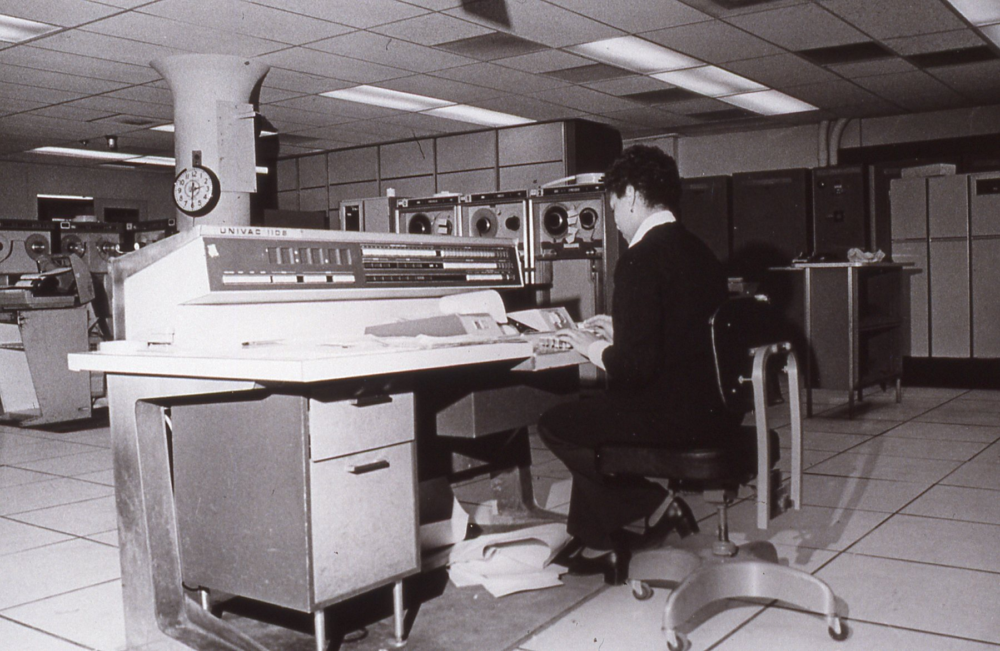

# The UNIVAC 1108 and VIEW

*A UNIVAC 1100-series machine at the U.S. Census Bureau, 1970s (public domain; [Wikimedia Commons](https://commons.wikimedia.org/wiki/File:Univac_1108_Census_Bureau.jpg), titled there "Univac 1108"). Not the MSC installation.*

This page answers one question: could the FORTRAN in this repo have run on the machine the original MSC "VIEW" program ran on, and how fast? Everything below is tagged as **found** (with a source), **inference** (our reasoning from found facts), or **not found**.

Sources are the Sperry Rand/UNIVAC manuals mirrored on bitsavers.org and fourmilab.ch, plus NASA NTRS, including NASA-CR-150010 / MCR-76-382 (Martin Marietta Denver contractor report for MSFC, 30 Sept 1976, cited below as NASA-CR-150010). Page references are the printed section-page numbers visible in the scans (for example "4-10" is section 4, page 10; PDF page indexes were not recorded). The scans are OCR-noisy, so quoted numbers were cross-read against other tables. Rule for this page: found facts cite a source; inference and assumptions are labelled; estimates show inputs and arithmetic. Where only a secondary web page exists, that is stated.

## Spec table

| Item | Value | Source |
|---|---|---|
| Word size | 36 bits, binary | [UP-4046 Rev 3, sec. 2-4](https://www.bitsavers.org/pdf/univac/1100/1108/UP-4046r3_UNIVAC_1108_System_Description_1970.pdf) |
| Single-precision float | 1 sign + 8-bit exponent (biased, true range -128..+127) + 27-bit fraction; range 10^-38 to 10^38, "eight-digit precision" | UP-4046 Rev 3, sec. 4.5.7, pp. 4-9 to 4-10 |
| Double-precision float | 72 bits in two words: 1 sign + 11-bit exponent (true range -1024..+1023) + 60-bit fraction; range 10^-308 to 10^307, "18-digit precision" | UP-4046 Rev 3, pp. 4-10; [NASA-CR-150010 (MCR-76-382), Table II](https://ntrs.nasa.gov/citations/19760026161) (10^-308..10^308, 18 digits) |
| Integer | 36-bit, magnitude up to 2^35 - 1 | NASA-CR-150010, Table II |
| Main storage type | Core, "read/restore" cycle 750 ns | UP-4046 Rev 3, sec. 2.2.3 (p. 2-3) and 3.1 |
| Effective storage cycle | 375 ns with up to four logical banks overlapping, plus two-way interleave | UP-4046 Rev 3, sec. 2.2.3 (p. 2-3) |
| Max main storage | 262,144 words (65,536-word increments); = 9,437,184 bits = 1,179,648 8-bit bytes (about 1.1 MiB, arithmetic ours) | UP-4046 Rev 3, sec. 2.2.3 (p. 2-3) and 3.1 |
| Add / load (fixed) | 0.75 us (alternate-bank access; +0.75 us same-bank) | UP-4046 Rev 3, App. C, pp. C-1 to C-9 |
| Multiply (integer/fractional) | 2.375 us | UP-4046 Rev 3, App. C |
| Divide (fixed) | 10.125 us | UP-4046 Rev 3, App. C (notes 4/5: +.25 us in some cases, see below) |
| Single-precision FP add / multiply / divide | 1.875 / 2.625 / 8.25 us | UP-4046 Rev 3, App. C (divide: note 4, +.25 us if 28 rather than 27 subtractions) |
| Double-precision FP add / multiply / divide | 2.625 / 4.25 / 17.25 us | UP-4046 Rev 3, App. C (divide: note 5, +.25 us if 61 rather than 60 subtractions) |
| Double load (2 words) | 1.50 us | UP-4046 Rev 3, App. C |
| Internal control registers | 128 registers, 125 ns cycle | UP-4046 Rev 3, sec. 2 (control registers; also sec. 4) |
| Multiprocessing | Up to 3 central processors + 2 I/O controllers sharing the storage modules | UP-4046 Rev 3, sec. 3.1 |
| Drums | FH-432 (4.3 ms avg access, 1.44 M char/s), FH-1782 and FH-880 (17 ms; FH-880 at 360 K char/s); FASTRAND also offered | UP-4046 Rev 3, sec. 2.2.4 (p. 2-3) and sec. 8.2 |
| Tape | UNISERVO VI-C, VIII-C, 12, 16 subsystems | UP-4046 Rev 3, sec. 8.4 |
| OS | EXEC 8 (named in the 1966 Executive Reference Manual and the 1970 EXEC 8 user guide) | [UP-4144 Executive Reference Manual](https://fourmilab.ch/documents/univac/manuals/pdf/1108/UP-4144_1108_Executive_Reference_Manual_1966.pdf); [UE-637 EXEC 8 user guide](https://fourmilab.ch/documents/univac/manuals/pdf/1108/UE-637_1108execUG_1970.pdf) |

Instruction times above are the manual's per-instruction figures (App. C, pp. C-1 to C-9), not measured throughput; notes 4 and 5 there add .25 us to some divides. A separate 1108 II timing table: not found.

Rough speed (inference, arithmetic ours): 1 / 0.75 us = 1.33 million simple instructions per second; 1 / 2.625 us = 0.38 and 1 / 4.25 us = 0.24 million DP FP operations per second, before operand loads and stores. The Datapro report [70C-877-11-7009](https://ftp.mirrorservice.org/sites/www.bitsavers.org/pdf/datapro/datapro_reports_70s-90s/Univac/1100/70C-877-11_7009_UNIVAC_1106_1108.pdf) is an image-only scan that we could not read; any vendor-quoted MIPS/MFLOPS is therefore not found.

## What our `DOUBLE PRECISION` means by comparison

- **Range**: 1108 double is about 10^-308 to 10^307; IEEE binary64 is about 2.2e-308 to 1.8e308. Effectively the same range, so no overflow surprises in either direction.
- **Precision**: 1108 double has a 60-bit fraction (about 18 decimal digits); IEEE binary64 has a 53-bit significand (about 15.95 digits). The 1108 carries about 7 more mantissa bits, so its results are slightly more accurate per operation. Our WebAssembly kernel is therefore the coarser machine; differences would appear around the 16th digit and grow through long recurrences.
- **Single precision**: 1108 `REAL` (27-bit fraction, about 8 digits) is comparable to IEEE binary32 (24-bit, about 7.2 digits). If the kernel uses `REAL` anywhere, it maps to a slightly better format on the 1108.
- **Behaviours that differ**: found: single-precision FP results are two words, with the low-order residue in a second register (UP-4046 p. 4-10); the format has a biased exponent and a complemented word for negative values (UP-4046 p. 4-10). Not found in the sources read: rounding rules, denormal/NaN handling. Inference: bit-for-bit reproduction of 1968 output is not to be expected given the different formats.
- **Mixed types**: FORTRAN V permits mixing types in one expression except logical, and double with complex ([UP-4046 sec. 10.4.1](https://www.bitsavers.org/pdf/univac/1100/1108/UP-4046r3_UNIVAC_1108_System_Description_1970.pdf)).

## Software: EXEC 8 and FORTRAN V

**Found.** FORTRAN V "has all the features of the proposed ANSI FORTRAN IV language plus many valuable extensions" (UP-4046 sec. 10.4). The reference manual is UP-4060 (1966; listed in the [Computer History Museum catalog](https://computerhistory.org/collections/catalog/102799051), not available as a scan on the mirrors we could reach). Extensions listed in UP-4046 sec. 10.4.1 include: PARAMETER (compile-time constants), ABNORMAL, alternate `RETURN k`, up to 7 subscripts, internal subprograms, mixed-mode expressions, extended subscript expressions, backward DO loops, generalized assigned GO TO, and (stated as "not available with FORTRAN IV or earlier") FLD bit-field function, NAMELIST, DEFINE (inline statement functions), INCLUDE, IMPLICIT type statements, ENTRY, DELETE, G/T/L format edit codes, `READ (unit,fmt,ERR=n,END=m)`, Boolean functions AND/OR/XOR/COMPL/BOOL, and free-field input. Library routines are selected by argument type (SQRT / DSQRT / CSQRT).

**Encke/Cowell integration context**: not found. we found no source tying a specific integration method to the 1108 at MSC. Apollo trajectory work is documented elsewhere but was not verified here.

## Would VIEW-1108 run on a real 1108? Portability rules

These are rules to audit the kernel elements (`src/*.f`) against; we did not audit the source. Evidence quality varies and is marked.

| Question | Answer | Confidence and source |
|---|---|---|
| Identifier / symbol length | 6 alphanumeric characters maximum (CDC allowed 7; "UNIVAC 1108 FORTRAN V permits only six") | Found: [NASA-CR-150010](https://ntrs.nasa.gov/citations/19760026161), sec. 3.1 item b. Also COMMON block names 1-6 chars, first alphabetic (Table I) |
| Character set | 6-bit Fieldata, "6 FIELDATA CHAR/WORD" (NASA-CR-150010 Table II); Fieldata has no lower case, so source was effectively upper-case (inference). An "ASCII FORTRAN" manual exists for a later system ([UP-8244.2](https://ftp.mirrorservice.org/sites/www.bitsavers.org/pdf/univac/1100/fortran/UP-8244.2_1100_ASCII_Fortran_10R1_1982.pdf), 1982) | Found for Fieldata word packing; upper-case-only is inference; ASCII compiler date found |
| Source format (columns) | Not found in the sources reached; presumed card-image, fixed form (inference) | Not found |
| `IMPLICIT NONE` | Not in FORTRAN V. Only `IMPLICIT type (a1,a2,...)` with alphabetic ranges, and type may be DOUBLE PRECISION | Found: UP-4046 sec. 10.4.1 and NASA-CR-150010 Table I. Absence of `NONE` is inference from the statement definition |
| `INCLUDE` | Exists, but as `INCLUDE name[,LIST]` naming an element previously filed with the procedure definition processor, not a file path | Found: UP-4046 sec. 10.4.1 |
| `BLOCK DATA` | In the language. But the NASA-CR-150010 conversion notes say the UNIVAC loader loads only elements that are referenced, so BLOCK DATA subprograms "must not be used" (or must be referenced explicitly) on that toolchain | Found (1976, Martin Marietta contractor report for MSFC; toolchain-specific, treat as caution): NASA-CR-150010 sec. 3.1(g) |
| `DATA` statements | Listed as supported; `DATA` with implied-DO lists: not found | Found for basic DATA (NASA-CR-150010 Table I); implied DO not found |
| Double-precision intrinsics | DSIN, DATAN2, DSQRT, DEXP, DLOG, DLOG10, DABS, DMOD, DASIN, DACOS, DTAN, DSINH, DCBRT etc. all present; generic use resolves by argument type | Found: NASA-CR-150010 Table I item 13; UP-4046 sec. 10.4.1 |
| Array dimensions | Up to 7 | Found: UP-4046 and NASA-CR-150010 Table II |
| Array / program size | Physical max 262,144 words. A per-run limit of 65K words (batch) and 32K (interactive) is reported in NASA-CR-150010 (a 1976 Martin Marietta study of MSFC computers) for MSFC, so MSC 1968 limits may differ. Exact EXEC 8 program-size limit: not found | Physical max found; per-program limit found for a different site and year only |
| DO-loop rules | DO index may not be altered inside the loop; index value undefined after loop exit (save it in a separate variable) | Found: NASA-CR-150010 sec. 3.1(d), (e) |
| Hollerith in FORMAT | Apostrophe strings `'...'` supported (asterisk form is CDC only) | Found: NASA-CR-150010 sec. 3.1(c) |
| `STOP n` / `PAUSE n` | `n` may be 1 to 6 alphanumeric characters | Found: NASA-CR-150010 Table I |
| COMMON layout | Loader allocates the longest appearance of each named COMMON, so declarations must be consistent across elements | Found: NASA-CR-150010 sec. 3.1(f) |
| Fixed integer overflow | Integers are 36-bit; `I <= 2^35 - 1` | Found: NASA-CR-150010 Table II. If the kernel packs 32-bit or 64-bit integers, it will not map |
| Free-form / modern statements | `DO ... END DO`, `CHARACTER`, `IF/THEN/ELSE`, `SELECT CASE`: not found in FORTRAN V. Block IF is not listed among the extensions in UP-4046 (inference: absent) | Not found; inference |

## The recorder: CRT to microfilm

**What VIEW itself said:** "The view program operates on the UNIVAC 1108 computer. The program is written in the FORTRAN V language." Its graphic display "consists of microfilm frames produced by a camera that photographs an image constructed on the surface of a cathode-ray tube. The image is formed by dots, and ... lines and curves may be produced by connecting the dots." (NASA TN D-6853, Hyle & Lunde 1972, printed p. 3; `reference/TN-D-6853_Hyle_Lunde_1972.pdf`, NTRS 19720017950.) The report does not name the recorder model.

**Which recorder at MSC**: not found. No source we reached names the recorder at MSC. Contemporary practice: the Stromberg-Carlson SC-4020 (Charactron shaped-beam tube; see below) had a UNIVAC 1107 output subroutine package ([S-C 4020 brochure, Apr 1965](https://ftp.mirrorservice.org/sites/www.bitsavers.org/pdf/strombergDatagraphix/brochures/S-C_4020_Computer_Recorder_Brochure_Apr1965.pdf) lists "UNIVAC 1107"). Whether MSC's used an SC-4020, an SC-4060, or another CRT recorder is not established. Treat the SC-4020 material below as representative, not confirmed for MSC.

**How an SC-4020 exposed a frame (found, [S-C 4020 Information Manual, Aug 1964](https://ftp.mirrorservice.org/sites/www.bitsavers.org/pdf/strombergDatagraphix/SC_4020/S-C_4020_Computer_Recorder_Information_Manual_Aug1964.pdf) and [Programmers' Reference Manual 9500056, Jun 1968](https://ftp.mirrorservice.org/sites/www.bitsavers.org/pdf/strombergDatagraphix/SC_4020/9500056_S-C_4020_Computer_Recorder_Programmers_Reference_Manual_Jun1968.pdf)):**

- A 7-inch Charactron tube writes on a 1024 x 1024 addressable grid. A camera is mounted opposite the tube face; a 35 mm camera records the 4-inch tube image as a 17.5 mm square at 16 frames per foot; a 16 mm camera is also available. Film is 35 or 16 mm, perforated or not (Information Manual; brochure).
- The camera shutter is opened by `SELECT CAMERA` commands (opcode 41, 42, 43 = both) and the film advanced one frame by the `ADVANCE FILM` command, opcode 46: "causes the film in the camera (or cameras) selected to be advanced one frame" (Programmers' Reference Manual, Advance Film section). `RESET` performs ADVANCE FILM, STOP TYPE, and EXPOSE HEAVY together.
- Order codes (36-bit words on tape, from the [SC-4020 instruction summary](https://www.content-animation.acorn-web-design-wantage.co.uk/computer_animation/ordercode.htm), a secondary transcription of the manual): `00 PLOT` (plot character C at X,Y; a dot is a plotted character), `06 DRAW VECTOR` (from X,Y to X+SX*DX, Y-SY*DY), `30/32 GENERATE X/Y AXIS`, `20 TYPE SPECIFIED POINT`, `46 ADVANCE FILM`, `37 STOP`. Maximum single vector length is 1/16 of full deflection, so longer lines are chained (Information Manual, "Vector Generator").
- Host library: the vendor's FORTRAN-callable "V" package (`CAMRAV`, `RESETV`, `GRID1V`, `FRAMEV`, `SETMIV`, `RITE2V` and so on) is documented in the 1968 Programmers' Reference Manual, but for IBM 7090/7094 FORTRAN II and IV. A UNIVAC 1108 or MSC in-house plotting package: not found.
- Online versus offline: both. "Capable of accepting digital signals off-line from magnetic tape or on-line from a digital computer" (Information Manual). From tape the recorder can take in up to 90,000 six-bit characters/s (tape intake rate, not the recording rate); recording proceeds at 12,000 characters/s from tape, or 17,000 characters/s on-line from a 36-bit word machine (brochure). Whether MSC ran it online from the 1108 or off tape: not found; off-line tape is the common practice (inference).

**Recorder speed (found, brochure):** recording rate 12,000 characters/s from tape and 17,000 characters/s on-line; the 90,000 characters/s figure above is tape intake only. Camera speed: "up to 10 frames per second" for the 35 mm camera (Information Manual). Optional hard-copy paper camera needs 0.75 s to initiate a frame advance. **Vector or point rate: not found** in the manuals we could read.

**Estimate, seconds per frame (recorder only, not the 1108):** assume each vector costs roughly one character time, about 60-85 us (1/17,000 to 1/12,000 s), and that long lines split into about two segments each on average. Then:

| Vectors per frame | Recorder time | Note |
|---|---|---|
| 3,000 | about 0.4 to 0.5 s | 3,000 x 2 x ~75 us |
| 30,000 | about 4 to 5 s | 30,000 x 2 x ~75 us, plus tape transfer of 180,000 six-bit characters, at least 2 s of tape intake at 90,000 char/s |
| Film advance | 0.1 s (35 mm at 10 fps) | negligible |

Uncertainty is at least 2x either way because the vector rate is assumed.

## NASA MSC installation

- **Building and division (found)**: a Univac photo caption, "circa 1967", states one of "four such machines installed in the Computation and Analysis Division facility in the Manned Space Flight center's Building 12" ([SuperStock image 4368-153](https://www.superstock.com/asset/state-art-univac-circa-which-one-four-machines-installed-computation/4368-153); a stock-photo caption, secondary).
- **How many (sources disagree)**: four (SuperStock caption, circa 1967); a Univac photo caption of "a scientific computing complex that included five UNIVAC 1108 computers ... operated by the center's Computation and Analysis Division"; and a UNIVAC official quoted as "seven 1108s ... involved in Project Apollo" (the last two in the [VIP Club article](https://www.vipclubmn.org/Articles/Apollo%2011-20190802Weyrick.pdf); the seven may include machines outside MSC, not clarified). Counts probably reflect different dates. Install dates: not found.
- **What they ran (found, secondary)**: "engineering and scientific calculations before, during and after all missions"; the 1108s analysed launch-area wind data from a UNIVAC 418 to compute abort trajectories, and processed spacecraft performance data afterwards (same VIP Club article, quoting a Univac caption). This supports a batch/scientific role.
- **Real-time versus batch**: no source we retrieved states which computers ran the Mission Control real-time complex, so this page makes no claim about it. The (secondary) sources above support the 1108s being the Computation and Analysis Division's scientific batch machines, which is consistent with VIEW being an offline batch program producing microfilm.
- Another NASA site for contrast: MSFC (Huntsville) had two 1108s in 1976 ([NASA-CR-150010, NTRS 19760026161](https://ntrs.nasa.gov/citations/19760026161)).

## Restomod arithmetic (estimate only)

Assumptions: one frame = about 20,000 double-precision FP operations (mix of add/multiply), about 2,000 transcendental calls, about 30,000 vectors output. These are the task figures, not measurements of our kernel.

**On a 1108 (estimate):**

1. Plain FP ops: average of DP add and multiply = (2.625 + 4.25) / 2 = 3.44 us. Compiled FORTRAN also loads and stores operands; assume 2x overhead, so about 7 us per source-level operation. 20,000 x 7 us = 0.14 s.
2. Transcendentals: no 1108 library timing was found. Assumption (ours, unsourced):  a `DSIN`/`DEXP`/`DATAN2`-class call costs about 30 FP operations plus call overhead, about 100-200 us. 2,000 x 150 us = 0.3 s.
3. Vector words: each vector needs scaling, clipping, integer conversion, packing into a 36-bit order word, and a buffered tape write. Assume about 30 instructions at about 1 us = 30 us. 30,000 x 30 us = 0.9 s.
4. Total compute is about 1.3 s, plausible range 0.7 to 3 s. The frame's compute and the recorder time (about 4-5 s at 30,000 vectors, above) are the same order, so the recorder would be a similar or larger bottleneck.

**On a modern CPU (about 3 GHz; assumed, not measured):**

1. 20,000 FP ops at about 1 ns effective = 20 us.
2. 2,000 transcendentals at about 20-50 ns = 40-100 us.
3. 30,000 vectors at about 20-50 ns each to generate coordinates = 0.6-1.5 ms (rasterising, if done, dominates).
4. Total under 2 ms per frame, so about 1 ms is a fair round number (assumed, not measured).

**Ratio**: 1.3 s / 1 ms (the 1 ms is assumed, not measured) is about 1,000x, roughly three orders of magnitude. The modern-CPU figures (1 ns per op, 20-50 ns per transcendental or vector) are unsourced assumptions of this page, not measurements; measure the real kernel before quoting them.

## Image credit

The photograph at the top is a U.S. Census Bureau image of a UNIVAC 1100-series computer, 1970s, public domain ([Wikimedia Commons](https://commons.wikimedia.org/wiki/File:Univac_1108_Census_Bureau.jpg), sourced there to [census.gov/history](https://www.census.gov/history/)). The Bureau's description says "UNIVAC 1100 series"; the Commons file title says 1108. No public-domain photograph of the MSC 1108 installation with a confirmed source was found.

## Cross-check: the u1100 emulator (secondary)

[patbarron/u1100](https://github.com/patbarron/u1100) is an unfinished 1100/20 (1108) emulator, BSD-3-Clause-Clear; the repo has only an instruction-set list, design notes and headers, no CPU code, no floating-point code, and nothing on EXEC 8, FORTRAN V, tape/drum timing or plotters. Everything below is from an emulator author's notes, not a primary manual.

Agrees: `doc/TIMELINE.md` line 17 gives the 1108 integer add as 750 ns and FP divide as 8250 ns, matching our 0.75 us and single-precision 8.25 us (its source is not cited there; its instruction list `data/instruction-set.txt` cites UP-8215 and MASM UP-8453, not UP-4046).

Adds (not in our table, unverified against UP-4046): 1106 add 1000 ns and FP divide 11000 ns (`doc/TIMELINE.md` line 19), and 1100/20 (MOS memory) add 875 ns and FP divide 8325 ns (line 21).

Not covered: it has no float format, rounding or truncation information, so our "rounding rules: not found" stands.

## References

1. UNIVAC 1108 System Description, UP-4046 Rev 3, 1970: https://www.bitsavers.org/pdf/univac/1100/1108/UP-4046r3_UNIVAC_1108_System_Description_1970.pdf
2. UNIVAC 1108 Processor and Storage Reference Manual, UP-4053, 1966: https://www.bitsavers.org/pdf/univac/1100/1108/UP-4053_1108_Processor_and_Storage_Reference_Manual_1966.pdf (not read in depth; timings above come from UP-4046 App. C)
3. UNIVAC 1108 Executive Reference Manual, UP-4144, 1966: https://fourmilab.ch/documents/univac/manuals/pdf/1108/UP-4144_1108_Executive_Reference_Manual_1966.pdf
4. FORTRAN V Programmer's Reference, UP-4060 (1966), catalog entry only: https://computerhistory.org/collections/catalog/102799051
5. Payload/Orbiter Contamination Control Requirement Study: Computer Interface, NASA-CR-150010 / MCR-76-382, Martin Marietta Denver (contractor report for MSFC, contract NAS8-31574), 30 Sept 1976 (FORTRAN IV to FORTRAN V conversion tables): https://ntrs.nasa.gov/citations/19760026161
6. S-C 4020 Computer Recorder Information Manual, Aug 1964: https://ftp.mirrorservice.org/sites/www.bitsavers.org/pdf/strombergDatagraphix/SC_4020/S-C_4020_Computer_Recorder_Information_Manual_Aug1964.pdf
7. S-C 4020 Computer Recorder Programmers' Reference Manual 9500056, Jun 1968: https://ftp.mirrorservice.org/sites/www.bitsavers.org/pdf/strombergDatagraphix/SC_4020/9500056_S-C_4020_Computer_Recorder_Programmers_Reference_Manual_Jun1968.pdf
8. S-C 4020 brochure, Apr 1965: https://ftp.mirrorservice.org/sites/www.bitsavers.org/pdf/strombergDatagraphix/brochures/S-C_4020_Computer_Recorder_Brochure_Apr1965.pdf
9. SC4020 instruction (order code) list, secondary: https://www.content-animation.acorn-web-design-wantage.co.uk/computer_animation/ordercode.htm
10. VIP Club, Apollo 11 / Univac article (Weyrick): https://www.vipclubmn.org/Articles/Apollo%2011-20190802Weyrick.pdf
11. SuperStock caption, 1108 in Building 12: https://www.superstock.com/asset/state-art-univac-circa-which-one-four-machines-installed-computation/4368-153
12. NASA image, Virginia Baker at the 1108, 1972: https://www.nasa.gov/image-detail/virginia-baker/
13. UNIVAC 1100 ASCII FORTRAN, UP-8244.2, 1982: https://ftp.mirrorservice.org/sites/www.bitsavers.org/pdf/univac/1100/fortran/UP-8244.2_1100_ASCII_Fortran_10R1_1982.pdf
14. u1100 partial 1100/20 emulator, secondary (emulator author's notes, not a manual): https://github.com/patbarron/u1100

## Not found

- Which recorder MSC used; MSC install dates; EXEC 8 program-size limits at MSC; a primary source for MSC's real-time computer complex; FORTRAN V source column format; implied-DO in DATA; vendor-quoted MIPS/MFLOPS; transcendental function timings; SC-4020 vector drawing rate; a UNIVAC 1108 or MSC plotting library name; original URL of the repo's photo.
